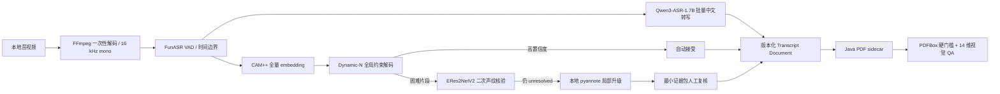

# MediaTranscribeStudio

MediaTranscribeStudio 是一个面向中文会议的**离线优先、动态说话人数、可审计**桌面转写系统。当前重构目标不是在旧 Python GUI 上继续叠加功能，而是建立一条可验证的新生产链：

```text
React + TypeScript
→ Tauri 2 / Rust 进程监督
→ Python 模型与领域编排
→ FunASR + Qwen3-ASR-1.7B + CAM++ 成本级联
→ ERes2NetV2 / pyannote 困难片段升级
→ 人工复核与增量恢复
→ Java OpenHTMLtoPDF + PDFBox
→ PDF 结构/视觉质量门禁
```

> **当前状态：大规模重构中，尚未达到商业发布门槛。**
> `frontend-design-pack-global` 当前仍报告 `implementationReady=false`、`releaseEligible=false`；真实模型环境和完整桌面垂直链路也仍需通过最终验证。系统对这些条件一律 fail-closed，不会把不完整结果包装成成功。

## 核心原则

- **任意说话人数**：支持 `speakerCountMode = auto | manual | hybrid`。五人会议只是 `N=5` 回归样例，不是产品上限。
- **精度优先但不浪费算力**：CAM++ 承担全量主声纹通道；ERes2NetV2 只复核低 margin、离群、短片段、边界冲突或 overlap 等困难片段；仍无法解决时才升级本地 pyannote。
- **人数或角色不确定就停**：自动人数置信度不足、speaker cardinality 不一致、模型依赖不可用或证据冲突时进入 `REVIEW_REQUIRED`，禁止静默合并、截断或减少角色。
- **原文可追溯**：`rawText` 永久只读；`normalizedText` 和 `displayText` 的每次变更都必须保存理由、证据和人工决定。
- **不翻译、不总结、不文学润色**：只允许有声学、词表、上下文或人工证据支持的中文错字、同音字、专名、标点、断句、语气词、口吃和机械重复修正。
- **本地小 LLM 仅建议**：当前已测试的小模型均不允许自动修改说话人、turn、overlap 或正文。所有建议必须通过 schema、确定性验证和人工接受。
- **唯一 PDF 链**：目标生产路径只允许 Java `OpenHTMLtoPDF 1.0.10 + PDFBox 2.0.30`；Python 不生成、不渲染 PDF。
- **完全离线**：禁止运行时模型下载、远程字体、CDN、遥测、远程图片和会议内容上传。

## 高精度、高效率说话人流水线



### Dynamic-N 不变量

确定后的 `N` 必须同时满足：

1. canonical ID 连续为 `speaker-1` 到 `speaker-N`；
2. `speakerCount`、speaker set、CAM++ score vector、speaker profile 和所有 segment 映射基数一致；
3. `manual` 模式严格等于用户指定人数；
4. `hybrid` 模式严格位于 `minSpeakers` 与 `maxSpeakers` 之间；
5. 资源不足只能产生可恢复失败，不能改变语义人数；
6. overlap 子段必须保留父子时间边界、文本来源、证据和人工锁定；
7. 人工锁定优先级最高，高 CAM++ margin 不得仅凭语言风格覆盖。

完整设计见 [`docs/refactor/ARCHITECTURE.md`](docs/refactor/ARCHITECTURE.md)。

## 仓库结构

```text
apps/desktop/                  React + TypeScript + Tauri 2 桌面端
backend/                       Python 生产 worker、协议、持久化和模型编排
contracts/                     版本化 JSON/JSONL 契约与 schema
reporting/                     Transcript → ReportDocument 与 Java sidecar client
pdf-renderer/                  OpenHTMLtoPDF + PDFBox Java 模块
benchmarks/                    脱敏本地 LLM 与质量基准
docs/refactor/                 架构、任务清单、迁移和旧代码删除门槛
tests/                         Python 契约、Dynamic-N、review 与生产 composition 测试
production.config.example.json 生产配置结构示例（路径为占位符，不可直接运行）
```

仓库根目录仍保留旧 Python UI、旧 pipeline 和旧 PDF 代码，原因是替代链尚未完成全部真实端到端验收。它们会按照 [`docs/refactor/LEGACY_REMOVAL.md`](docs/refactor/LEGACY_REMOVAL.md) 在**入口切流、等价性验证、动态人数、PDF QA、安装与回滚均通过后**删除，而不是长期双栈共存。

## 开发环境

### 必需运行时

- Windows 11
- Node.js 22+
- Rust stable
- Python / Conda 环境 `media-asr`
- FFmpeg
- Java 17+
- Maven 3.9+
- 全部模型与字体均为本地文件

### 桌面端

```powershell
cd apps/desktop
npm ci
npm run typecheck
npm test -- --run
npm run build

cd src-tauri
cargo fmt --check
cargo check
cargo clippy --all-targets --all-features -- -D warnings
cargo test
```

### Python 后端

```powershell
conda run -n media-asr python -m pytest -q
```

严格生产预检：

```powershell
conda run -n media-asr python -m backend.worker `
  --config C:\absolute\path\to\production.config.json `
  --preflight
```

输出是单行 JSONL。预检会验证：

- 允许的输入根目录、输出目录和缓存目录；
- 本地 FunASR、Qwen3-ASR、CAM++、ERes2NetV2 与可选 pyannote 模型目录；
- FFmpeg、Java 和包含指定引擎的 Java PDF JAR；
- 必需 Python runtime import；
- 离线环境策略。

拓扑诊断：

```powershell
conda run -n media-asr python -m backend.worker `
  --config C:\absolute\path\to\production.config.json `
  --diagnose
```

`production.config.example.json` 只展示 schema 和策略字段，里面的路径是安全占位符，必须复制为未跟踪的本地配置并替换为真实绝对路径。

### Java PDF sidecar

```powershell
cd pdf-renderer
mvn test
```

目标产物不仅是 PDF，还包括：

- 离线 XHTML/HTML；
- PDF；
- 每页 PNG；
- 联系表；
- artifact manifest 与 SHA-256；
- PDF 质量报告；
- 确定性 `repairQueue`。

任何文本、segment、时间戳、speaker set、字体、裁切、空白页或离线性硬门槛失败，都会阻止成功状态；视觉分数不得抵消内容错误。

## Worker 协议

Rust 与 Python 通过版本化 JSONL 协议通信。生产 worker 支持：

```text
job.start
job.cancel
job.resume
job.rerender
review.queue
review.submit
speaker.rename
speaker.merge
speaker.split
suggestion.accept
suggestion.reject
worker.health
worker.shutdown
```

每个命令和事件都有 `schemaVersion`、`requestId`、时间戳和结构化 payload。Rust 负责子进程启动、超时、取消、崩溃检测和恢复；Python 负责模型、领域不变量、持久化和 Java sidecar 调用。

## 本地小 LLM 结论

已完成脱敏、时间连续 held-out 和 safety challenge 基准：

- `qwen2.5:1.5b`：`reject_for_production`
- `qwen3.5:4b`：`reject_for_production`

因此当前生产策略只有：

```text
localLlmMode = disabled | suggestion-only
autoApply = false
```

小模型可以生成结构化建议，但不能自动修改说话人、overlap、turn 结构、人工锁定或普通中文正文。即使输出 JSON 可解析，也不等于语义修改安全。

## 质量与性能验收

系统分别报告以下指标域，禁止压成可互相抵消的总分：

| 指标域 | 必须报告 |
|---|---|
| 人数估计 | exact-count accuracy、count MAE、欠分/过分率、人工复核率 |
| 说话人分离 | DER、JER、speaker confusion、speaker attribution、overlap precision/recall |
| 时间边界 | boundary MAE/F1、漏段率、重复覆盖率、overlap 父子边界合法率 |
| ASR | 只基于 `rawText` 的 CER、专名错误率、空段/幻觉率 |
| 语义建议 | schema 通过率、precision/recall、越界修改率、证据充分率、人工接受/拒绝率 |
| 效率 | RTF、阶段 p50/p95、峰值 VRAM/RAM、缓存命中率、升级片段率、重算音频占比 |
| PDF | 内容完整性硬门槛、字体/裁切/空白/离线性与 14 个 Design Pack 维度 |

没有人工真值时，不宣称 DER/JER；真实媒体、逐字稿、声纹 embedding、声纹证据和模型路径不得提交到 Git。

## 当前已知阻断

- `media-asr` 环境中的 pyannote/torchaudio 兼容性仍需真实修复和预检；
- ERes2NetV2/ModelScope 依赖完整性仍需真实验证；
- Tauri → Rust → Python → Java → PDF QA 垂直链路尚需最终 E2E；
- 动态人数最小矩阵 `N=1/2/5/8/13` 与更大 `N` 资源压力仍需全量通过；
- `frontend-design-pack-global` 自身当前不是 implementation-ready/release-eligible；
- 旧 Python GUI、旧 pipeline、旧 PDF 与旧 packaging 尚未达到安全删除门槛。

任务进度见 [`docs/refactor/TASKS.md`](docs/refactor/TASKS.md)。在这些阻断关闭前，本项目不能被描述为商业发布就绪。

## 隐私与提交规则

- 不提交会议媒体、逐字稿、说话人 embedding、声纹评分、人工真值或敏感日志；
- 不提交模型权重、缓存、Conda 环境、Node build、Rust `target` 或 Maven `target`；
- 不把访问令牌、下载地址或个人绝对路径写入生产配置；
- 所有真实作业仅在明确允许的输入根目录和输出根目录内运行；
- 输出、缓存和报告版本必须可追溯、可重建、可验证。
