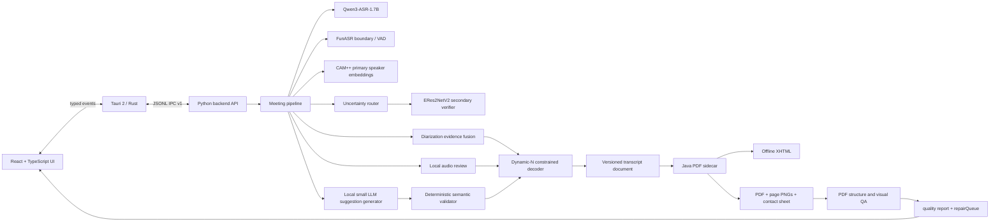

# 目标架构

> 审计日期：2026-07-21
> 状态：目标架构已经建立部分替代组件，但旧入口、旧流水线、旧 PDF 链路与固定五人约束仍未完成退役。

## 设计目标

- 完全离线处理中文会议，不上传音频、逐字稿、说话人声纹或人工真值。
- 说话人数支持自动检测、手动指定和混合约束；目标契约接受任意正整数 `N`，不把五人会议或任何固定常量写成系统上限。
- ASR、时间边界、声纹、局部音频复核和上下文语义互相提供证据，但任何单一模型都不能无约束修改说话人或中文原文。
- 采用“便宜证据先行、只对不确定片段升级”的效率级联；禁止默认对整段会议重复运行最昂贵模型。
- 说话人分离、人数估计、时间边界、ASR、语义建议、性能和 PDF 质量分别计量，禁止用单一综合分数掩盖任一硬失败。
- Python 只承担模型、音频、领域编排和 sidecar 调用，不再承担桌面 UI 或 PDF 渲染。
- React + TypeScript UI、Tauri 2/Rust 桌面壳、Python 后端、Java PDF sidecar 通过版本化 JSON/JSONL 契约解耦。
- 旧实现只有在新链路通过等价性、完整性、动态说话人数、离线性和回滚验证后才能删除。

## 组件图



## 动态说话人数契约

### 模式

`speakerCountMode` 必须是以下之一：

- `auto`：由声纹聚类和全局解码估计人数。
- `manual`：用户指定任意正整数 `N`。
- `hybrid`：自动估计结合用户先验、`minSpeakers` 和 `maxSpeakers`。

`N` 的领域约束为任意正整数。产品可以基于设备能力声明可解释的单次作业资源预算，但该预算不是产品人数语义上限；资源不足时必须给出可恢复错误或转入人工分批处理，禁止静默截断、合并角色或退化为固定人数。

### 规范化标识

- canonical speaker ID 必须连续：`speaker-1`、`speaker-2`、…、`speaker-N`。
- `speakerCount`、speaker ID 集、CAM++ score vector、speaker profile 和 segment 映射的基数必须一致。
- 手动模式必须满足 `speakerCount == N`。
- 混合模式必须满足 `minSpeakers <= N <= maxSpeakers`。
- 自动模式无法可靠确定 `N` 时必须进入人工复核，禁止静默猜人数。
- 五人真实会议与合成 fixture 只作为 `N=5` 回归样例；最小回归矩阵至少覆盖 `N=1/2/5/8/13`。

### 证据与全局解码

每个候选发言段保留：

1. CAM++ 到全部 `N` 个全局 speaker centroid 的相似度和 margin。
2. diarization 后验、FunASR 时间边界和 VAD 置信度。
3. 当前 turn 与相邻 turn 的时间、重叠、停顿和不能自相重叠约束。
4. 问句—回答、称谓、角色职责、话题连续性和自我指称特征。
5. 局部音频重跑、人工试听和人工锁定的复核结果。
6. 语义模型的结构化建议、证据代码和适用范围。

全局解码必须：

- 输出与确定后的 `N` 完全一致的角色集合。
- 尊重人工锁定，不得被自动流程覆盖。
- 尊重高 CAM++ margin；没有更强声学或人工证据时不得仅凭语言风格重分配。
- 将低置信度、冲突证据、人数不确定和 overlap 候选送入 review queue。
- 对多人串话拆分验证父子时间边界包含关系、最小时长和文本来源。
- 在任何 cardinality invariant 失败时 fail-closed，不生成“看似成功”的最终报告。

## 效率级联

生产链按成本由低到高升级，所有中间产物以输入 hash、模型版本、参数和契约版本为缓存键：

1. **一次性预处理**：音频解码、重采样、VAD、FunASR 时间边界和基础特征只生成一次；失败恢复不得无理由重算已验证产物。
2. **全量基础通道**：对全部候选段运行 Qwen3-ASR 基础转写、CAM++ 首轮 embedding/centroid 打分和确定性约束，不调用本地小 LLM，也不全场双跑声纹模型。
3. **不确定性路由**：仅将低 CAM++ margin、边界冲突、overlap、人数不确定、短片段、离群 embedding 或规则冲突片段送入更高成本复核。
4. **定向重算与二次声纹验证**：只对入队片段执行局部音频切片、重分段、ERes2NetV2 二次 embedding/候选核验、候选 ASR 或上下文窗口扩大；不得默认重跑整场会议。CAM++ 是速度优先的全量主通道，ERes2NetV2 是质量优先的难例 verifier。
5. **语义建议**：确定性规则仍无法解决时，本地小 LLM只能生成结构化建议，不能直接修改说话人、turn 结构或中文原文。
6. **人工复核**：只展示仍有冲突或高影响的最小证据包；人工锁定结果进入后续增量解码，避免全局无差别返工。
7. **增量报告**：只有版本化 transcript document 通过硬门槛后才调用 Java sidecar；内容未变时复用已验证 artifact，内容变更时只重建受影响报告版本。

每一级必须记录触发原因、输入范围、耗时、缓存命中、CPU/GPU/显存峰值、输出置信度和退出原因。调度器必须具备有界队列、背压、取消、恢复和设备感知并发；超预算时 fail-closed，不得以降低说话人数或覆盖人工结果换取完成。

## 分离指标与验收

所有指标按层独立报告，并按会议时长、实际 `N`、overlap 比例、片段长度和设备分桶：

| 指标域 | 必须单独报告 | 不允许的替代 |
|---|---|---|
| 人数估计 | exact-count accuracy、count MAE、欠分/过分率、人工复核率 | 不得用 segment accuracy 代替人数正确性 |
| 说话人分离 | DER、JER、speaker confusion、speaker attribution accuracy、overlap recall/precision | 不得用 ASR CER 或语义连贯度抵消错分角色 |
| 时间边界 | boundary MAE/F1、漏段率、重复覆盖率、父子 overlap 边界合法率 | 不得把“文本看起来完整”当作边界通过 |
| ASR | `rawText` CER、专名错误率、空段/幻觉率 | 不得用 `normalizedText` 或 `displayText` 回填后成绩冒充原始 ASR |
| 语义建议 | schema 通过率、建议 precision/recall、越界修改率、证据充分率、人工接受/拒绝率 | 不得把模型自报置信度当质量指标 |
| 系统效率 | RTF、阶段 p50/p95、峰值 VRAM/RAM、缓存命中率、升级片段率、重算音频占比 | 不得只报总耗时而隐藏昂贵阶段或失败重试 |
| 报告/PDF | segment/text/timestamp/speaker 完整性、字体与结构硬门槛、14 个 Design Pack 维度 | 美学分数不得抵消内容缺失或角色错误 |

删除旧架构或发布前，必须分别满足预先登记的各域阈值和硬门槛。可以展示只读总览，但不得把这些指标压成一个可相互抵消的“总质量分”。

## 本地小 LLM 生产门控

`qwen2.5:1.5b` 与 `qwen3.5:4b` 的正式本地基准结论均为 `reject_for_production`。其中 `qwen3.5:4b` 在 88 个脱敏样本上的最终契约有效率为 `0.784`、越界文本修改率为 `0.205`、auto-apply 候选回归率为 `0.135`；安全挑战契约有效率仅为 `0.625`，未达到预登记门槛。当前架构不得在生产逐字稿上调用这两个模型；若未来重新评测模型，只能先作为隔离的 suggestion generator，即**仅建议、永不自动应用**：

- 输出必须经过 JSON/schema 和 deterministic validator。
- 模型自报置信度不作为自动应用依据。
- 不得修改说话人、拆分或合并 turn、处理 overlap、翻译、总结或润色。
- 不得覆盖人工锁定或高 CAM++ margin。
- 普通中文原文不得由该模型自动改写；仅可提出标点、语气词、口吃和机械重复清理建议。
- 所有建议必须可拒绝、可追踪，并保留修改前后文本和理由。

正式报告同时证明 `qwen3.5:4b` 在关闭 thinking 后能稳定返回 JSON，但“JSON 可解析”不等于“修改安全”。其说话人字段和 turn 拆分字段本来就被输出 schema 禁止，因此该评测不能被解释为说话人分离准确率。说话人角色仍只由声学证据、全局约束、局部音频复核和人工锁定决定。

只有重新基准达到预先登记的契约、安全、越界修改、风险升级和回归阈值后，才能重新讨论自动应用；完成 benchmark 本身不代表生产可行。

## 中文原文语义优化

系统保存三层文本：

- `rawText`：ASR 原始输出，只读。
- `normalizedText`：标点、断句、常见口误和确定性术语修正。
- `displayText`：经审核的中文逐字稿展示文本。

允许的改动：

- 修正有声学、术语表或人工证据支持的错字、同音字、专有名词和断句。
- 删除纯语气词、口吃和机械重复，但必须保留变更审计。
- 拆分有时间边界和音频证据支持的多人串话。

禁止的改动：

- 翻译。
- 文风润色、总结、补写、改变态度或改变事实强度。
- 添加原音频中不存在的事实。
- 用小 LLM 猜测不确定内容后直接覆盖原文。

## PDF 架构

```text
pdf-renderer/
  pom.xml
  src/main/java/
    app/              CLI 与作业编排
    contract/         JSON 输入输出
    render/           OpenHTMLtoPDF
    inspect/          PDFBox 结构检查
    qa/               硬门槛、14 维度、repairQueue
  src/main/resources/
    templates/
    fonts/
    schemas/
```

固定渲染依赖：

- `com.openhtmltopdf:openhtmltopdf-pdfbox:1.0.10`
- `org.apache.pdfbox:pdfbox:2.0.30`

Python 端只：

1. 写入版本化转写 JSON。
2. 启动 Java sidecar。
3. 消费结构化结果和进度事件。

当前 Java validator、XHTML 文案、PDF 元数据和部分测试仍写死五人，因此 Maven 测试全绿不能视为动态人数替代链已经完成。

## 内化的 PDF 质量循环

### 硬门槛

- PDF 可被 PDFBox 打开，页数大于零。
- 全部发言文本可提取，segment ID 和发言段数量与输入完全一致。
- 时间戳单调、有界、格式合法，并与输入毫秒值一致。
- 输入 speaker set 中全部 `N` 位角色均存在图例、标签和非颜色区分，且输出不得新增、漏掉或合并角色。
- 中文字体嵌入，不依赖远程字体。
- 没有空白页、裁切、内容越界或不可打印对象。
- 不含远程 URL、脚本、遥测或网络依赖。
- 每页 PNG、联系表和测试证据存在且 SHA-256 可验证。

任一硬门槛失败时，分数和视觉精致度不能抵消失败。

### 14 个美学维度

沿用全局 Design Pack 的稳定 ID：

1. `AESTHETIC-COHERENCE`
2. `AESTHETIC-DISTINCTION`
3. `AESTHETIC-REFINEMENT`
4. `AESTHETIC-PROPORTION`
5. `AESTHETIC-HIERARCHY`
6. `AESTHETIC-TYPOGRAPHY`
7. `AESTHETIC-COLOR-RELATIONSHIPS`
8. `AESTHETIC-RHYTHM`
9. `AESTHETIC-DENSITY`
10. `AESTHETIC-RESTRAINT`
11. `AESTHETIC-REAL-CONTENT-STRESS`
12. `AESTHETIC-FONT-FAILURE`
13. `AESTHETIC-IMAGE-FAILURE`
14. `AESTHETIC-SCRIPT-FAILURE`

### 循环规则

- 分数必须至少为 85。
- 第一轮也必须有本地结构测试和页面截图证据。
- 第二轮起必须重拍截图、重跑测试、完整重评分并检查更高优先级回归。
- `repairQueue` 按严重度、硬门槛、维度权重和稳定 ID 排序。
- 最多五轮；第五轮后仍不合格则状态为 `blocked`，不能宣称已通过。

## Design Pack 发布门控

- `frontend-design-pack-global/repository-index.json` 在本次复核时已经存在；此前记录的“文件缺失”是历史 blocker，不得继续写成当前事实。
- 系统仍必须把该索引缺失、不可解析或校验失败视为 fail-closed 条件。
- 当前全局包保持 `runtimeOfflineReady=true`、`implementationReady=false`。
- `EVIDENCE-OPEN-001`、`CONTENT-OPEN-001`、`ASSET-OPEN-001` 仍是 blocking open questions。
- 在 `implementationReady=true`、阻断问题关闭并生成项目专属证据前，禁止宣称 UI、PDF 或应用商业发布就绪。
