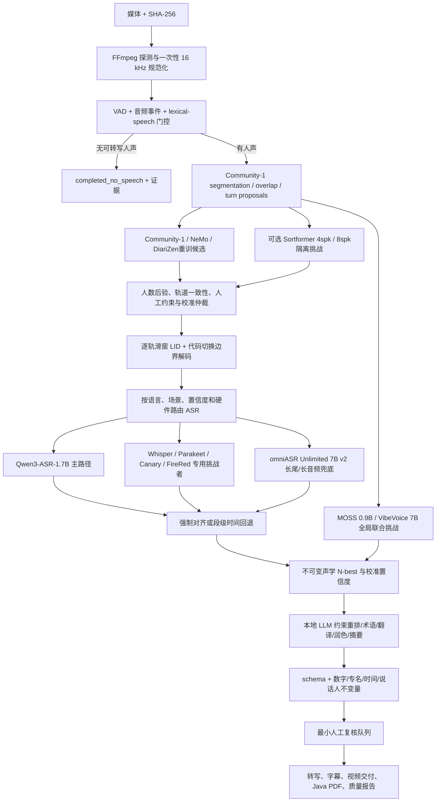

# 旗舰多语种语音系统架构决策

> 决策日期：2026-07-26
> 适用范围：离线人声判断、Dynamic-N 总人数说话人分离、有界并发重叠、多语种/代码切换转录、时间对齐、翻译、润色、字幕和报告
> 决策原则：先选择能力上限高且可部署的基模，再用路由、量化、缓存和分层硬件解决效率；不以当前 16 GB M4 的单机容量降低系统质量上限，也不把“完全离线”与“托管前沿能力”混为同一个部署约束。

## 能力上限定义

“世界最高端”不是挑一个模型名称，而是保留三个不能互相冒充的部署档：

1. **托管前沿质量档**：在用户逐次明确授权媒体上传、数据保留策略和成本后，允许 `pyannote Precision-2`、AssemblyAI `Universal-3.5 Pro`、ElevenLabs `Scribe v2`、Speechmatics `Melia 1`、`gpt-4o-transcribe-diarize` 以及后续登记的托管基模参加同音频挑战。Precision-2 是当前官方同口径榜单中的纯 diarization 能力上限候选；Universal-3.5 Pro 是高优先级的联合 who/what 挑战者；Scribe v2 提供 90+ 语言和最多 32 人；Melia 1 提供逐词语言与中途代码切换。它们均只在远端运行，供应商自报指标也不是同一独立榜单，因此不能替代离线产品承诺或直接获得生产权威。
2. **私有自托管旗舰档**：在受控 GPU 服务器运行 Qwen3-ASR-1.7B、`omniASR_LLM_Unlimited_7B_v2`、Community-1/VBx、NeMo 挑战者和服务器 LLM。这是默认的高质量生产上限，原始媒体不离开用户控制的基础设施。
3. **M4 边缘质量档**：使用相同契约、缓存和证据链串行运行可容纳模型；资源不足时升级到私有服务器或明确降级，不能把 16 GB 能运行的小模型结果宣称为全系统上限。

托管模型、开源模型和本地量化模型均须使用相同冻结音频、相同计分与失败域比较。外部模型只因公开榜单领先而进入候选池，不会自动获得生产路由权；私有媒体不得为了比较而静默上传。

自托管旗舰必须先用官方原始精度 checkpoint、官方预处理和官方推理栈建立服务器参考结果，再在同一冻结输入上测量量化、蒸馏、MLX/GGUF/ONNX 转换或较小解码器的绝对质量损失。边缘派生模型即使更快，也只能获得边缘路由，不能反向代表或替换基模上限；若官方原始精度权重无法在已登记硬件上复现，则该模型尚不满足“可落地旗舰”。微调同样不能先于强基模基线：只有明确失败分桶才允许训练 adapter，并必须同时通过目标分桶、未见语言对、原单语能力和其他场景的 backward-retention 门禁。

“语言覆盖数”也只表示候选适用域，不表示所有语言都达到同等质量，更不表示任意未见语言组合的代码切换已经解决。2026 年公开研究仍观察到代码切换 ASR 对未见语言对的泛化有限；本系统因此按语言、地区、语言对、同一说话人切换和跨说话人切换分别校准，支持集外输出必须允许 `und` 和人工复核。

## 结论

系统采用“旗舰级联 + 专用挑战者 + 长尾兜底”，不采用一个模型包办全部任务：

1. `Qwen3-ASR-1.7B` 是其 30 种语言和 22 种中文方言支持集内的首选 ASR 基模。官方模型卡把它描述为开源 ASR 中的 SOTA，并提供语言识别、流式/离线推理、长音频和独立强制对齐器。
2. `pyannote/speaker-diarization-community-1` 的 powerset segmentation、WeSpeaker embedding 和 VBx clustering 是当前已落地的离线 Dynamic-N 基线与 incumbent，不再被视为私有旗舰的唯一权威。其全局人数没有官方 Sortformer 4spk 的固定四输出限制，并原生接受 `num_speakers`、`min_speakers` 和 `max_speakers`；但真实 N=5/N=8 已证明自动聚类会漏轨，派生 N=13 极端 overlap 已证明即使强制人数恢复全部轨道，身份和时间质量仍会失败。私有旗舰必须并行引入 NeMo cascaded/MSDD、许可兼容重训的 DiariZen 架构以及 MOSS/VibeVoice 联合审计，再用人数后验、轨道一致性和校准仲裁决定权威。托管前沿档以 `pyannote Precision-2` 为纯 diarization incumbent：pyannote 官方在无 collar、保留 overlap 的同表 12 个基准中报告其 `12/12` DER 低于 Community-1；但它不是离线 checkpoint。
3. `MOSS-Transcribe-Diarize 0.9B` 是当前优先级最高的可自托管联合挑战者：公开 Apache-2.0 权重、128k 上下文、单次最长 90 分钟、50+ 语言、逐段自动语言、时间戳、说话人和事件/重叠标签，并有官方 Transformers、SGLang 和 vLLM 路径。其 2026-07-09 权重和 14 语言比赛结果很新，模型需 `trust_remote_code=True`，公开论文的主要多人集集中中文/英语且指标以 CER/cpCER 为主；因此必须先审计远程代码、幻觉、漏轨、人数、DER/JER、overlap 和时间边界，不能因参数小或作者榜单领先直接替代声学 RTTM 权威。
4. `omniASR_LLM_Unlimited_7B_v2` 是服务端支持集外语言和长音频的旗舰兜底，覆盖 1600+ 语言。官方 checkpoint 为 7,801,041,536 参数、FP32 下载约 30 GiB、推理显存约 17 GiB，15 分钟 A100 样本 RTF 为 `0.208`；普通 CTC/LLM suite 仍只接受短于 40 秒的输入，unlimited 变体当前不提供微调 recipe。`CTC-300M/1B` 只能作为低成本召回或本机兼容候选，不能用小模型、普通 7B 或第三方转换结果代表 unlimited 7B 上限。
5. `Whisper large-v3` 是成熟的独立第二意见。在 Apple Silicon 上优先验证 WhisperKit/Core ML 或 whisper.cpp/Metal，而不是把 CUDA 路径直接搬到 MPS。
6. `Parakeet-TDT-0.6B-v3` 是 25 种欧洲语言的高吞吐专用挑战者；`Canary-Qwen-2.5B` 是英语专用挑战者。二者只有在本项目 held-out 分桶同时改善 WER、时间轴和效率时才能接管相应路由。
7. `VibeVoice-ASR-7B` 是服务器级联合挑战者：公开 MIT 权重、Transformers/vLLM 部署、60 分钟单次上下文、50+ 语言/代码切换，并直接生成 who/when/what。它的公开报告同时明确 serialized 输出在 overlap 会漏掉次要说话人，SFT 主要集中英语/中文；因此用于全局一致性、长上下文和语义挑战，不能抹掉 Community-1 的多轨 overlap 真值。2026-07-23 发布的 `VibeVoice-ASR-BitNet` 将原 Qwen2.5-7B 解码器替换为 1.5B，并使用 INT8/I2_S 压缩到 1.58 GB；论文报告通常增加 `1–4%` 绝对 WER，所以它只进入 CPU 边缘效率挑战，必须以同音频原始 7B 结果为质量锚点。
8. `FireRedASR2S` 是中文和中英代码切换专用挑战者：8B+ LLM / 1B+ AED、20+ 中文方言/口音、100+ 语言 VAD/LID、singing/music 多标签门控和中英 punctuation 均有公开权重与部署代码。`FireRedASR2-LLM` 官方模型卡明确单次输入上限为 40 秒，因此只能在有界切分上评测；它可接管已验证的中文方言、歌声或人声门控分桶，但不能代表 1600+ 语言、任意长音频或任意多人 diarization。
9. `DiariZen` 是高价值的 Dynamic-N 研究挑战者。独立 196.6 小时五语言比较报告其总体 DER `13.3%`，仅次于托管 PyannoteAI/Precision-2 的 `11.2%`，且 5+ 人分桶 DER `7.1%`；但当前最佳公开权重为 CC BY-NC 4.0，默认商业产品只能研究评测或复用 MIT 代码以许可兼容数据重训，不能打包其权重。
10. NVIDIA 官方 Sortformer 只用于 `N <= 4` 的低延迟候选或审计证据。官方公开 checkpoint 输出维度固定为 4，且在 5 人以上数据上的 DER 明显退化。2026-03 发布的第三方 Apache-2.0 `Ultra Diar Streaming Sortformer 8spk` 由官方 4spk 基模经 2 张 H100 微调与结构修改扩到最多 8 人，可进入隔离研究挑战，但它仍是固定容量、非 NVIDIA 官方权重，且模型卡没有足够的独立跨域结果，不能成为“任意人数”权威。`TagSpeech`、`SpeakerLM`、`Speaker-Reasoner` 等 joint SDR 研究保留为研究挑战，公开权重/数据域不足时不得进入默认路由。
11. 本地 LLM 与声学权威完全分离。当前 M4 的下一候选是 `qwen3.5:9b` Q4_K_M；服务器质量档至少评测 `Qwen3.5-35B-A3B`，资源允许时再评测 `122B-A10B`。LLM 只能在已有声学 N-best 内做约束重排、术语、翻译、保守润色和证据化报告，不能创建说话人、语言或原音频不存在的文本。

这些是模型晋级候选，不是发布声明。官方自报指标只用于缩小候选集，最终权威是本项目按数据源、录音、说话人隔离的 held-out 结果。

## 模型决策矩阵

| 能力域 | 旗舰权威 | 挑战者/兜底 | 不能作为通用权威的原因 |
|---|---|---|---|
| 人声活动与内容门控 | 轻量 VAD + Community-1 segmentation + ASR no-speech 共识 | Silero VAD、独立音频事件分类器 | 单独 VAD 不能区分歌词、音乐中人声、笑声和可转写词汇 |
| 托管前沿 diarization | Precision-2（仅经逐次授权的可上传媒体） | 后续托管模型按相同盲测登记 | 远端推理不满足默认离线和数据不出域约束；官方榜单不能替代本项目 held-out |
| 托管联合说话人转录 | Universal-3.5 Pro、Scribe v2、Melia 1 按分桶同音频挑战 | gpt-4o-transcribe-diarize、Soniox/Deepgram 等登记后参加 | U3.5 仅 18 种全精度代码切换语言；Scribe v2 最多 32 人；Melia 1 为 batch early access 且无 confidence/speaker identification；供应商自测不能互相直接比较 |
| 私有任意总人数 diarization | Community-1/VBx 当前基线；Community-1 + NeMo cascaded/MSDD + DiariZen 重训候选的校准仲裁 | CAM++/ERes2NetV2、SpeakerKit Core ML | 单个聚类或固定输出模型不能独立解决边界、重叠和人数；N=5 已证明 Community-1 自动漏轨且 exact-N 不保证身份映射 |
| Dynamic-N 研究上限 | Community-1、DiariZen 与 NeMo 同音频比较 | 以许可兼容数据重训 DiariZen 架构 | DiariZen 最佳公开权重为 CC BY-NC 4.0，只能研究比较，不能进入默认商业模型包 |
| 低延迟有界人数 diarization | Community-1 仍保留最终审计 | NVIDIA Streaming Sortformer 4spk；第三方 Ultra Sortformer 8spk 仅研究 | 固定 4/8 个输出通道都不是任意人数；第三方 8spk 尚无充分独立跨域结果 |
| 30 语言/22 中文方言 ASR | Qwen3-ASR-1.7B | Whisper large-v3、Parakeet 欧洲语种、Canary-Qwen 英语 | 路由挑战者的覆盖或硬件路径更窄 |
| 1600+ 长尾/长音频 ASR | `omniASR_LLM_Unlimited_7B_v2` 服务端 | 普通 LLM-7B/7B-ZS、CTC 300M/1B | Unlimited 7B 下载约 30 GiB、推理约 17 GiB 且暂无微调 recipe；普通 suite 输入 `<40s`；覆盖不等于每种语言都达到发布质量 |
| CPU 边缘联合 ASR | 原始精度服务器旗舰保留质量锚点 | VibeVoice-ASR-BitNet、whisper.cpp 量化候选 | 1.5B BitNet 是 7B 派生效率模型且公开报告有绝对 WER 损失；边缘胜出不等于基模胜出 |
| 长上下文联合转录/说话人/时间 | MOSS-Transcribe-Diarize 0.9B 优先挑战；VibeVoice-ASR-7B 独立挑战 | MOSS Pro 仅在供应商数据策略审核并逐次授权后参加 | 生成式单模型必须单列幻觉、漏轨、人数、overlap、时间边界和远程代码供应链风险，不能覆盖声学多轨证据 |
| 音频语言识别 | Qwen/Whisper/SpeechBrain VoxLingua107 校准共识 | 未来基于许可兼容数据训练更广 LID head | MMS-LID-4017 是 CC BY-NC 4.0，不能进入默认商业模型包 |
| 时间对齐 | Qwen3-ForcedAligner-0.6B 的 11 语言支持集 | 每语言 CTC aligner、WhisperX/MFA 候选 | 不支持的语言不得伪造词级时间戳，只能保留段级时间和复核状态 |
| 重叠说话 | Community-1 多轨活动 + 局部重叠路由 | 经 SI-SDRi 与 tcpWER 验证的局部分离/多说话人 ASR | 当前没有一个成熟开源模型能对任意语言、任意并发人数无条件分离；全场分离会引入伪影 |
| 文本推理与交付 | M4: Qwen3.5-9B 候选；服务器: 35B-A3B/122B-A10B 候选 | 4B 仅保留已验证的 suggestion-only 业务路径 | 4B 正式基准未达到自动修改门槛；更大参数也不能越过声学证据边界 |

## 目标数据流

## 关键实现规则

### 1. 人数与身份

- `auto` 输出人数后验分布、最优人数、候选区间和校准置信度，不只输出一个整数。
- `manual` 把用户人数作为硬约束，`hybrid` 把上下界和 prior 作为显式约束；约束必须进入每个支持它的模型原生调用、隔离进程协议、缓存身份和结果证据，任何模式都不能静默丢人或合并人。
- Community-1 常规时间线保存完整模型轨道和重叠并驱动 DER/JER、overlap 与边界评分；model-native exclusive 时间线只用于把粗粒度 ASR 段归属到唯一轨道，不能抹掉真实 overlap、改写或复制文本。两条时间线必须独立持久化并以 SHA-256 绑定，不能从有文本的 ASR segments 反向重建整段 diarization。
- Community-1 是当前生产基线，不是不可挑战的唯一权威。NeMo cascaded/MSDD、许可兼容重训的 DiariZen 和联合模型输出必须保留独立轨道与模型 revision；仲裁只有在同一冻结音频上通过人数、DER/JER、cpWER/tcpWER、overlap 和映射置信门禁后才能覆盖基线。
- 现有 CAM++/ERes2NetV2/Dynamic-N 降级为独立挑战者、跨段身份稳定证据和不变量检查器。它们或 LLM 都不得仅凭已知人数强行接受低置信 local-to-canonical 映射。
- 跨文件实名识别必须是另一个带用户授权的 voiceprint enrollment 功能。普通 diarization 只产生匿名 `speaker-N`，不能从声音猜姓名。

### 2. 多语言与代码切换

- 语言状态属于时间区间，不属于整个文件，也不默认属于某个说话人的固定属性。
- 在 diarization 轨道内以重叠滑窗获取 Qwen、Whisper 和独立 LID 后验，再用带最小驻留时间和切换惩罚的序列解码器定位切换点。
- 对低置信短片段同时保留多个语言候选；脚本特征只验证 ASR 输出，不能从文字反向伪造声学语言真值。
- Qwen 支持集外先进入 Omnilingual 服务端路径；若路由语言也无法可靠确定，则输出 `und` 与复核，不用相近语言硬猜。
- 同一说话人可连续切换语言；不同说话人也可使用相同或不同语言。聚类不得把语言差异当身份差异。

### 3. ASR 路由与融合

- 支持集内默认完整运行 Qwen3-ASR-1.7B，而不是先用 0.6B 决定最终文本；0.6B 只适合作为明确标记的低延迟预览。
- 专用模型按校准后的分桶规则接管：例如欧洲语种可比较 Parakeet，英语可比较 Canary-Qwen，Apple 本机可比较 WhisperKit，中文方言/歌声可比较 FireRedASR2S。VibeVoice-ASR-7B 作为整段联合挑战保留完整上下文，但其 serialized overlap 输出不得覆盖多轨重叠真值。
- 模型间不直接比较未经校准的自报 confidence。每个模型、语言、场景使用开发集拟合可靠性，held-out 只做一次晋级判断。
- 保存每个候选的模型 revision、原始文本、token/segment score、语言、时间范围和失败码。融合只能选择或组合可追溯候选。
- 数字、日期、专名和领域词单独计分。LLM 纠正必须引用候选或术语表，并保留 diff。

### 4. 重叠语音

- 先检测再局部升级，只对 overlap 区间加上下文 padding 运行分离或多说话人 ASR。
- 对整段联合模型输出与 Community-1 regular/exclusive 时间线做一致性比对；VibeVoice 只可提供长上下文和 speaker-turn 第二意见，不能把单流输出当作 overlap 完整转录。
- 晋级门禁同时要求 SI-SDRi 不下降、下游 tcpWER/cpWER 改善、说话人归属改善且非重叠区不被污染。
- 在该门禁通过前，系统可以准确保存“谁在何时重叠”，但不能宣称所有并发语音都已完整转录。

### 5. 本地 LLM

- 将音频模型全部卸载后再启动/保留 Ollama 推理，当前 16 GB M4 不并驻 Qwen3-ASR、Pyannote 和 9B LLM。
- 输入是带证据 ID 的 N-best、术语表和不可修改字段；输出必须是版本化 JSON patch 或派生产物。
- 说话人、时间、源文和 review blocker 默认只读。翻译、润色和摘要是独立文件，不覆盖 `rawText`。
- 自动应用需按任务和语言分别通过 held-out。`qwen3.5:9b` 参数更多不自动获得权限。

## 计算与模型生命周期

### 托管前沿质量档

- Precision-2 只接收公开样本、合成样本或用户对该次作业明确批准上传的媒体；授权、区域、供应商保留策略、请求 ID、模型版本、成本和删除状态进入审计链。
- 用同一冻结音频比较 Precision-2 与 Community-1/NeMo 的 DER/JER、人数、overlap 和 tcpWER。只有目标分桶 held-out 胜出才允许成为该分桶的 opt-in 路由，不能用供应商平均指标代替。
- 联合说话人转录优先加入 AssemblyAI `Universal-3.5 Pro`。其 2026-07-07 官方发布页报告 18 种原生代码切换语言，并在 AMI、CALLHOME、DiPCo、NOTSOFAR 六个分桶的供应商同表中得到平均 cpWER `30.17`，低于该表中的 Scribe v2 `35.26`、Nova-3 `37.92`、Voxtral Mini Transcribe V2 `37.52` 与 Soniox v5 Async `44.58`。这是供应商自选数据和实现的结果，不等于独立排名；必须锁定 API 模型 ID、实际返回版本和请求证据后重跑本项目 held-out。
- ElevenLabs `Scribe v2` 作为 90+ 语言、最多 32 人、词级时间戳的广覆盖挑战者；Speechmatics `Melia 1` 作为逐词语言、同一说话人中途切换的 batch 挑战者。Scribe 的 32 人仍是固定上限；Melia 1 是 early access、准确率仅声明与 Standard 相当，当前不返回 confidence、speaker identification 或 speech intelligence。这些边界必须进入路由，不得被“多语”标签掩盖。
- 托管 ASR 采用登记制 challenger pool：必须锁定模型版本、语言/场景适用域、数据策略和预算，再与自托管 Qwen/Whisper/Omnilingual 同音频比较。不存在未经本项目验证的“全球所有语言统一最佳 API”。

### 当前 M4 16 GB 质量档

- Community-1 Python/MPS 或 SpeakerKit/Core ML 二选一驻留，先以相同 RTTM 评分决定；当前已有 Community-1 本地完整模型和真实结果。
- Qwen3-ASR-1.7B 按 ASR 阶段加载一次，处理整批 speech windows 后统一释放；ForcedAligner 在需要的 11 种语言阶段单独加载。
- WhisperKit/whisper.cpp 作为第二意见时与 Qwen 串行，不同时占用统一内存。
- `qwen3.5:9b` 已安装为 Ollama model ID `6488c96fa5fa`，实际为 9.7B、Q4_K_M、6.6 GB；底层 blob SHA-256 为 `dec52a44569a2a25341c4e4d3fee25846eed4f6f0b936278e3a3c900bb99d37c`。只有声学阶段结束后才加载，完整质量晋级前保留 4B 回退；安装后数据卷约剩 15 GiB，仍需保留至少 8 GiB 工作空间。
- M4 的两条真实短样本对照证明跨 job 全常驻可将墙钟从 `197.53 秒` 降到 `135.40 秒`，但最低只剩约 14 MiB free pages，且现有 MPS 资源指标未捕获该压力。M4 私有配置因此使用 `modelResidency=stage`，在启动 9B 业务阶段前释放声学模型；`worker` 常驻留给已做容量门禁的服务器。
- 当前持久化 production runtime 固定为 CPython `3.12.13`，FunASR 导入前显式预载 `setuptools`，并对 CAMPPlus 做独立严格导入探针。FunASR VAD、Qwen3-ASR、Qwen3-ForcedAligner、CAMPlus、ERes2NetV2 和 Community-1 六个本地模型均通过 manifest/目录/SHA-256/符号链接与路径穿越门禁；隔离 Pyannote revision 为 `3533c8cf8e369892e6b79ff1bf80f7b0286a54ee`。2026-07-26 的真实私有配置 preflight 为 `30/30 passed`，`pip check` 无破损依赖。Java PDF renderer JAR 为 `34,195,098` bytes，SHA-256 `65a63c6f73391e203f986fe481de44beb0df8a58a026f9f16b3ff2c9ffa14e58`。两份私有配置只在本机使用，禁止提交。
- MOSS 官方 Hugging Face 快照已固定到 revision `e5118b411bf5a77d7a90c4941066bec93c967312`：19 个文件共 `1,833,163,202` bytes，manifest SHA-256 为 `89533dc712a143a1b0219daed6202485ee1020fab9172f449de21a2a702243fc`，权重 LFS SHA-256 为 `9a0ceb4ab7330357db3ff583dba8d83625d5b733b00e1d55d6970e11b07026c4`，审计报告 SHA-256 为 `3989a7b61ee9f066f0f6e4200072877c8aaa5c5c71e54dc942a2d7ce977b374d`。三份实际加载的 remote code 逐 AST/调用面检查未发现动态执行、网络、子进程、文件写入、pickle/`torch.load` 或敏感反射；官方辅助仓库固定 revision `0e3d1403fd8f1f1c674e883ece96b9f630794ebe`，核心推理路径同样无这些调用，Web/字幕层的 FFmpeg、临时目录清理和可选 vLLM HTTP 路径不在本地 Transformers 烟测执行面内。官方代码中的 `model.eval()` 不是 Python 内置 `eval()`。
- MOSS 使用独立 Python `3.12.13` 环境，安装 PyTorch `2.13.0`、Transformers `5.14.1` 和官方包依赖，没有修改现有 production ASR 环境。强制离线、MPS FP16、greedy 的公开 LibriSpeech 3.505 秒 N=1 开发样本得到 `1/1` 人、逐词完全命中，原始输出 `[0.55][S01] Concord returned to its place amidst the tents.[3.43]`；推理 `16.1485 秒`、冷启动端到端 `26.84 秒`，最大 RSS/peak footprint 约 `3.05/3.22 GiB`。raw transcript/segments SHA-256 分别为 `534e5972ea9be1539dbb81deed7c5a76d969eef590e392d5dcb438712f4c5d40` / `0f46423f052124f0ce465b33a6bbdf56012088bc97a87e271188c460bf12baba`。
- 同配置对经过 RTTM 事件边界验证、确实包含两人的 90 秒 VoxConverse N=2 真实重叠窗口输出 `2/2` 人和 27 段，DER/JER 为 `0.198998179 / 0.201952120`、speaker confusion `0.010382514`；但串行生成没有恢复并发轨道，overlap F1 为 `0`，末时间戳 `90.03 秒` 超出媒体 `30 ms`，所以不能覆盖 Community-1 regular timeline。推理 `315.5265 秒`、冷启动端到端 `404.30 秒`，对应 RTF `3.5059 / 4.4922`，最大 RSS 约 `3.93 GiB`、macOS peak memory footprint 约 `17.09 GiB`、swap `0`；raw transcript/segments SHA-256 分别为 `a7311b19fdc73c689d134eeae53a7c529d2b573e162cc8a91d12130b564c39e6` / `06919bc36260d6a8b4b73f0750452db0a8650736a5791e80769831ab544138d3`。这支持继续在旗舰 GPU 服务器评测官方基模上限，同时否决其在当前 M4 上直接成为长音频默认路由。
- Community-1 regular/exclusive 双时间线已作为第一类生产输出落地。真实 90 秒 VoxConverse `N=2` 冷运行自动人数 `2/2`，regular/exclusive 分别为 `15/21` 段并通过独立哈希、映射双射、边界、完整 speaker coverage 和 exclusive 非重叠校验；DER/JER `0.036183971 / 0.041564942`、speaker confusion `0.006092896`、overlap F1 `0.930924004` 与此前 canonical 权威完全一致。边界预测由 ASR segments 改为 `speakerTimeline.regular` 后，预测/真值均为 `27/27`，mean/p50/p95/max 误差从先前 `4777/2060/16983/19240 ms` 改善到 `505/90/3796.1/5170 ms`。v6/v7 的 95 段 `rawText/normalizedText/displayText` 逐项一致，raw text 与三文本字段数组 SHA-256 分别为 `4c6f9a4e160123b62aca0d1d7792c02814ebbe0591a9a10b50c753ce799c3ee9` / `ab1b803b1aaa024700275f46437db5e14c54dab595eeffa0269c9c511cfd12a8`，证明本轮 ownership/timeline 修复没有改写 ASR 文本。但终态仍为 `review.required`，open review `194`，冷流水线 RTF `3.257265048`、峰值 RAM `1126.9375 MB`；它只通过 N=2 的时间线回归，不代表整体门禁、其他人数或交付闭环通过。
- 同一架构的真实 90 秒 VoxConverse `N=3` 回归自动人数 `3/3`，regular/exclusive 为 `22/19` turns 且哈希与 exclusive 非重叠校验通过；DER/JER `0.088232932 / 0.107817798`、speaker confusion `0.015240964`、overlap F1 `0.848613448`，边界预测/真值 `41/41`，mean/p50/p95/max 为 `518.682927/164/2953/5243 ms`。终态仍为 `review.required`、open review `176`；本次 ASR 来自同模型缓存，流水线 RTF `2.871221103`，其中 Pyannote overlap 阶段 `253.334 秒`、峰值 RAM `1355.28125 MB`，不能写成完整冷启动或 ASR 质量通过。
- 真实 90 秒 VoxConverse `N=5` 暴露了当前基线的上限。RTTM 选窗事先验证五人都实际发言，其中最短轨也有 `7.56 秒`，不是任取前 60 秒。自动 Community-1 只产生 4 个 local tracks；直接用原生 regular timeline 对 RTTM 评分为 DER/JER `0.203690760 / 0.395497618`、confusion `0.083873167`、overlap F1 `0.823224206`。早期 `oracle-v5` 仍复用了这条四轨缓存，`speakerCountConstraints=null`，因此是无效实验，禁止引用其人数结论。修复约束、隔离协议和缓存身份后，有效 `oracle-v6` 将 `num_speakers=5` 传入模型并得到 5 轨、regular/exclusive `36/32` turns；原生时间线 JER 改善到 `0.311625267`，但 DER 稍退到 `0.210023866`、confusion `0.090206273`，映射 margin 只有 `0.012279307 < 0.05`，所以系统按 `PYANNOTE_MAPPING_MARGIN_BELOW_THRESHOLD` 正确拒绝第一类 `speakerTimeline`。最终生产段评分同样没有晋级：自动/强制五人的 DER/JER 分别为 `0.425178998 / 0.646047627` 与 `0.427889533 / 0.503024358`。这证明 exact-N 可以恢复轨道并改善一项指标，但不能替代身份声学质量或多系统仲裁。
- 真实 VoxConverse `N=1` 使用同一固定 revision 的 row 35 与独立 RTTM，从源录音 `66.44–76.44 秒` 选择 10 秒窗口；标注为单一 `spk00` 全程有声、无 overlap，音频 SHA-256 `1c20312f43cd043063454cf24e2e7b97662ad9a169c14ab10ef375e74ee45c6b`。auto 与 manual=1 都得到 `1/1` 人，模型原生和最终 DER/JER 均为 `0.0061 / 0.0061`、confusion `0`、overlap F1 `1.0`，边界最大误差 `31 ms`，原生时间线哈希同为 `6e2c37924fcb304fb41721aa02554b7ca64b0f2129310ae50fb405f7198117d1`。auto/manual 分别有 `22/2` 个 open review，终态都为 `review.required`；auto 冷路径 RTF `16.506691267`、harness 墙钟 `214.501 秒`，manual 的 RTF `0.541344504`、cache hit `0.625` 和墙钟 `38.678 秒` 只能作为热/混合路径。该窗口无完整逐字真值，禁止评分 ASR、语言和联合说话人转录质量。
- 真实 VoxConverse `N=8` 使用 `event-boundary-max-overlap-v1` 从源录音 `33.32–123.32 秒` 选取 90 秒窗口，RTTM 事先证明 8 人都发言，含 `21.32 秒` overlap；不是任取前 60 秒。auto 只生成 `5/8` 轨，模型原生整段时间线 DER/JER/confusion/overlap F1 为 `0.273713504 / 0.588543117 / 0.206596715 / 0.868788226`，最终生产段为 `0.348102190 / 0.580200114 / 0.097454380 / 0.807241415`，open review `195`。manual=8 恢复 `8/8` 轨，原生 DER/JER/confusion 为 `0.255428832 / 0.479361090 / 0.188312044`，但最终生产段反而退化为 `0.470072993 / 0.752708789 / 0.249178832`，open review `35`。auto 的流水线 RTF `0.008303897`、cache hit `0.995708155` 只能作为热缓存修复回归；manual 原生阶段 RTF `1.113355130`，harness 墙钟分别为 `34.794 / 137.257 秒`。该样本没有覆盖窗口完整逐字稿，WER/cpWER/tcpWER/SA-WER 均禁止评分。
- 派生 `N=13` 仅是 `synthetic-mixture-of-real-recordings` 的 `development-stress`：13 条真实 MINDS 多语录音合成为 79.21 秒单声道，最高同时 13 路重叠，SHA-256 `a8d01e3cbb9e34ded9f3053a8b5f0041d3ee31776b8fabf27592a313fbf1c980`；不得称为真实 13 人会议。auto 只生成 `2/13` 轨，原生 DER/JER/overlap F1 `0.712199056 / 0.873672210 / 0.848195027`，最终生产段 `0.830970738 / 0.932436923 / 0.469812075`，open review `94`、冷路径 RTF `7.067597293`。manual=13 恢复 `13/13` 轨和 65 个原生 turns，但原生 DER/JER/confusion 仍为 `0.762341924 / 0.813559118 / 0.061860831`，最终生产段 `0.849992005 / 0.921678180 / 0.099993743`，open review `25`。给定人数只恢复容量，不能修复极端 overlap 下的身份归属；该压力样本也未取得可用于重叠逐字评分的权威转写，禁止报告 WER/cpWER/tcpWER。
- 评估器现在把每个 segment 携带的、SHA-256 绑定且完全一致的 `fullTimelineInference` 作为 `model-native-full-timeline-unmapped` 独立计分，校验完整 segment 覆盖、媒体范围、turn 数、speaker inventory 和 `speakerTurnsSha256`；任何快照变化或哈希篡改立即失败。`nativeDiarizationQuality/nativeBoundaryQuality` 与最终生产段 `diarizationQuality/boundaryQuality` 永不互相覆盖，避免 canonical mapping 或 ASR segment 粒度掩盖基模真实上限。
- 多人联合转录评分固定使用 `meeteval==0.4.3`、上游 revision `badcd3c7cf82f98d2ac1f292801fbe6e9093ee2f`。cpWER/cpCER 允许文本最优 speaker permutation；tcpWER/tcpCER 采用 5 秒 collar 和逐段伪词时间；本项目的 SA-WER/SA-CER 明确定义为先以纯声学时间重叠做 maximum-weight Hungarian speaker mapping，再固定该映射由 MeetEval SISO 汇总。报告同时保存 token 单位、映射、插入/删除/替换、漏轨/多轨和依赖版本；中文必须标作 CER，多语混合必须标作 mixed-token error rate。三项优先读取不可变 `rawText`，不得评分语义润色后的 `displayText`。
- 同一冻结 AISHELL-4 19.54 秒真实五人普通话 held-out 首次完成上述联合评分。auto 输出 `11/5` 人，串行 CER `0.320388350` 但 cpCER/tcpCER/SA-CER 为 `0.796116505 / 0.796116505 / 0.825242718`，DER/JER `0.648323846 / 0.657510361`；manual=5 恢复 `5/5` 人并将三项改善到 `0.475728155 / 0.514563107 / 0.475728155`，但 DER/JER 仍为 `0.403542062 / 0.533735129`。两个任务均为 `review.required`，说明串行文本正确率和 exact-N 都明显高估最终 who-said-what 质量。
- 不在本机运行 `omniASR_LLM_Unlimited_7B_v2` FP32；本机只允许先测 CTC 300M/1B 或量化实现，且结果不能代表旗舰 unlimited 7B。

### 旗舰服务器质量档

- NVIDIA GPU worker 使用 Qwen 官方 vLLM/FlashAttention 路径；`omniASR_LLM_Unlimited_7B_v2` 和 NeMo 候选在独立进程/GPU 池中运行。
- 私有 diarization 旗舰不以 Community-1 单模型封顶：至少保留 Community-1/VBx、NeMo cascaded/MSDD 和许可兼容 DiariZen 重训三路独立候选；MOSS/VibeVoice 只提供联合 who/when/what 审计。每路都输出原生轨道、人数后验、映射置信和资源证据，校准仲裁可以选择、保留冲突或 abstain，不能平均掉漏轨与 overlap 硬失败。
- 每类模型一个有界 stage queue 和常驻 worker，跨 job 复用权重；相同音频窗口按 `audio hash + model revision + parameters + normalization version` 缓存。
- 多 GPU 通过流水线并行不同作业，不对同一片段默认全模型齐跑。第二意见只由不确定性或已登记分桶触发。

### 当前生命周期状态

2026-07-26 的 60 样本长共享 worker 重跑首先得到 `42 observed / 17 job.failed / 1 hard deadline`。17 个失败都在 `media_probe`，而本机独立 FFprobe 可正常读取源 WAV；hard deadline 样本在 675 秒内仍持续 heartbeat，但反复加载 Qwen/CAM++/ERes2NetV2。将失败样本按最多 4 个 job 的小会话复跑后，18/18 全部得到 `review.required`，无强制清理；合并后的 60/60 均有独立技术终态。由此形成以下生产规则：

- worker 在长推理期间持续发 heartbeat/progress；harness 分离 idle timeout 与不可延长 hard deadline，预算使用 `冷启动 p95 + 音频时长 * 分桶 RTF p95 + 安全余量`。
- M4 `stage` 模式的样本 runner 默认每个共享会话最多处理 4 个 job 后主动回收，仍保留会话内模型复用；服务器只有在统一内存/VRAM 压力门禁通过后才显式调大。恢复会话只继续未开始作业，历史失败结果不被覆盖。
- 媒体探测不再把 APFS 的纯 `mtime` 漂移误判为内容变化：探测前后同时核对设备、inode、大小和 SHA-256；字节变化仍以 `SOURCE_CHANGED` fail closed。5 条真实短音频已按 `4 + 1` 两个有界会话完成 `5/5 review.required`，无恢复会话、技术失败或强制清理。
- 恢复报告为 `60/60 observed`、`60/60 review.required`、自动人数 exact-count `26/60`、文档语言 exact-match `53/60`、原始语言段准确率 `540/605 = 0.892561983`、平均 WER/CER `0.311813840`、平均 RTF `12.227236553`。这证明技术终态闭合，同时明确证明现生产人数、语言广度、转录和复核量尚未达到发布质量。
- macOS 必须采集 MPS/统一内存与系统压力峰值，不能继续用 `peakVramMb=0` 或普通 RSS 作容量门禁。
- 并发 preflight 已改用同目录唯一可回收探针文件，并以 32 次、8 线程共享根回归验证；后续仍需在多进程 worker 启动压力测试中保留该门禁。
- 报告必须区分 `model-failed`、`job-timeout`、`batch-aborted` 和 `not-run`。

## 评测与晋级门禁

### 数据隔离

- 按 dataset、原始 recording、speaker identity 和派生源分组切分，禁止同录音章节或同说话人跨 development/held-out 泄漏。
- development 用于阈值、路由和校准；regression 用于日常防回退；held-out 在一个候选版本冻结后只运行一次。
- 全球短样本库用于广度和快速失败定位，不能单独证明远场会议、重叠、代码切换或任意人数质量。
- 增加 AMI/CHiME-6/LibriCSS/NOTSOFAR-1、AISHELL-4/AliMeeting、DIHARD/VoxConverse、SEAME/真实代码切换、MUSAN/AudioSet 类负样本以及带字幕真值的公开视频分桶；对 RW-Voice-EQ 等真实口音、情绪、噪声、背景说话人和对话压力样本先完成许可、同意范围与训练泄漏审计，再纳入独立分桶，不能用一个综合均分掩盖场景失败。

### 不可互相抵消的指标

| 域 | 主要指标 |
|---|---|
| 人声与内容 | speech frame F1、每小时误报、漏报、lexical/non-lexical macro F1、abstention rate |
| 人数 | exact-count accuracy、count MAE、欠分/过分率、人数后验校准误差 |
| diarization | DER/JER（含 overlap、0 collar 与标准 collar）、speaker confusion、overlap P/R/F1 |
| 联合说话人转录 | cpWER、tcpWER、SA-WER、漏说话人率；不能只分别报 DER 和 WER |
| ASR | 每语言 WER/CER、数字/专名错误率、幻觉率、空转录率 |
| 语言与切换 | macro F1、支持集内/外分开统计、切换点 MAE、PIER/切换词错误率、`und` 与复核率 |
| 对齐 | word/character AAS、边界 p50/p95、越过媒体时长或相互覆盖率 |
| 重叠分离 | SI-SDRi、重叠 tcpWER、非重叠污染率 |
| LLM 派生 | schema、数字/专名/说话人/时间不变量、COMET/MQM 或人工偏好、semantic drift |
| 系统 | 冷/热 RTF、阶段 p50/p95、峰值 RAM/VRAM、加载次数、缓存命中、升级率、失败隔离 |
| 交付 | cue 覆盖/CPS/CPL/安全区、多语字体、mux/burn-in 像素证据、PDF 内容与视觉硬门槛 |

模型只有在 held-out 的目标能力显著提升、所有硬失败域不回退且资源预算可解释时晋级。平均 WER、单条 DER 或官方 leaderboard 排名都不足以晋级。

## 落地顺序

1. 保持 60/60 独立终态，并用有界 worker 会话、hard deadline 和统一内存峰值持续验证失败隔离。
2. 已完成 Community-1 整段 regular/exclusive 第一类输出、真实 N=1/2/3/5/8 和派生 N=13 回归；下一步补更多真实 N>=8 和冻结的新 held-out，并为有完整逐字真值的多人样本补 cpWER/tcpWER/SA-WER。N=5/8 的自动漏轨、N=13 极端 overlap 失败和 exact-N 身份退化保持硬失败。研究环境并行比较 DiariZen 与 NeMo，商业默认不得使用 DiariZen 的 NC 权重；对公开可上传盲测另跑 Precision-2 同音频挑战。
3. 在已完成 MOSS-Transcribe-Diarize 0.9B 快照/remote-code 审计和本机 N=1/N=2 烟测的基础上，优先落地带 heartbeat、硬截止时间和边界裁剪检查的隔离 worker；先补齐真实 N=3/5、代码切换和 overlap 分桶，再在旗舰 GPU 服务器与 Community-1 + Qwen 级联及 VibeVoice-ASR-7B 做同音频联合转录挑战。必须同时比较 cpWER/tcpWER、DER/JER、漏轨、overlap、时间边界、幻觉、语言和资源，不因参数规模小而降低其优先级，也不因本机 FP16 MPS 边缘结果限制官方基模上限。
4. 固化 Qwen3-ASR-1.7B 支持集内基线，增加 Whisper large-v3 第二意见；按相同音频、相同切分比较 WER/CER、LID、时间和 RTF。
5. 在服务器烟测 `omniASR_LLM_Unlimited_7B_v2`，并用支持集外语言和长音频 held-out 验证；普通 LLM-7B/7B-ZS 单列短音频对照，不用 300M、普通 7B 或第三方转换结果替代 unlimited 7B。
6. 评测 FireRedASR2S 的中文方言/歌声/VAD-LID 分桶、Parakeet 欧洲语种、Canary-Qwen 英语和 Sortformer 1-4 人；只有分桶胜出才启用路由。
7. 建立真实代码切换和重叠多说话人门禁，再决定 LID 序列模型、分离模型或多说话人 ASR 的微调方向。
8. 在 M4 上完整评测 `qwen3.5:9b`，服务器评测 35B-A3B；先通过 suggestion-only，再分别评估翻译、润色、摘要和 N-best 重排。
9. 对逐次授权上传的同一冻结音频运行 Universal-3.5 Pro、Scribe v2、Melia 1 与其他登记 API，单列语言覆盖、说话人数上限、cpWER/tcpWER、DER/JER、代码切换、时间轴、成本、区域与删除证据；供应商自报胜负只用于候选排序。
10. 同一批 held-out 输出真实 SRT/WebVTT/ASS、soft-mux、burn-in、Java PDF 和证据报告，任何上游 blocker 都必须传递到发布状态。

## 官方来源

- [Qwen3-ASR-1.7B model card](https://huggingface.co/Qwen/Qwen3-ASR-1.7B), revision `7278e1e70fe206f11671096ffdd38061171dd6e5`, Apache-2.0。
- [Qwen3-ASR repository](https://github.com/QwenLM/Qwen3-ASR), 包含 vLLM、流式和 ForcedAligner 使用边界。
- [Omnilingual ASR official repository](https://github.com/facebookresearch/omnilingual-asr), Apache-2.0；官方 checkpoint card `omniASR_LLM_Unlimited_7B_v2` 下载约 30 GiB、推理约 17 GiB，普通 CTC/LLM suite 限 `<40s`，unlimited 变体暂无微调 recipe。旧 [LLM-7B Hugging Face card](https://huggingface.co/facebook/omniASR-LLM-7B) 只作为普通短音频模型来源，不能冒充 unlimited v2。
- [Parakeet-TDT-0.6B-v3](https://huggingface.co/nvidia/parakeet-tdt-0.6b-v3), revision `7c35754d166cca382ad1e53e68b01e7c575f3a1d`, CC BY 4.0。
- [Canary-Qwen-2.5B](https://huggingface.co/nvidia/canary-qwen-2.5b), revision `b1469e1bba1cfe140205529c79c434ca47180960`, CC BY 4.0；官方能力域为英语。
- [Whisper large-v3](https://huggingface.co/openai/whisper-large-v3) 与 [whisper.cpp](https://github.com/ggml-org/whisper.cpp)；后者明确支持 Apple Metal、Core ML、量化和 VAD。
- [Argmax open-source Swift speech stack](https://github.com/argmaxinc/argmax-oss-swift), MIT；WhisperKit 与 SpeakerKit 提供 Apple Core ML 路径，模型许可证仍需逐项随包审计。
- [Community-1 model card](https://huggingface.co/pyannote/speaker-diarization-community-1), revision `3533c8cf8e369892e6b79ff1bf80f7b0286a54ee`, CC BY 4.0；本机隔离镜像已固定并验证。
- [pyannote Community-1 / Precision-2 official benchmark](https://huggingface.co/pyannote/speaker-diarization-community-1#benchmark)，采用无 collar、保留 overlap 的统一 DER 表；Precision-2 为托管远端模型，不得写成离线依赖。
- [AssemblyAI Universal-3.5 Pro official release](https://www.assemblyai.com/blog/universal-3-5-pro-async)，2026-07-07；公开 18 种原生代码切换语言及 AMI/CALLHOME/DiPCo/NOTSOFAR 的供应商 cpWER 同表，必须标注为 vendor-reported 并独立复测。
- [ElevenLabs Scribe v2 official model documentation](https://elevenlabs.io/docs/overview/models#scribe-v2)，公开 90+ 语言、词级时间戳和最多 32 人 diarization；固定人数上限不能外推为任意人数。
- [Speechmatics model documentation](https://docs.speechmatics.com/speech-to-text/models#melia-1)，Melia 1 为 batch early access，逐词语言、支持同一说话人中途切换；当前无 confidence、speaker identification 和 speech intelligence。
- [MOSS-Transcribe-Diarize 0.9B model card](https://huggingface.co/OpenMOSS-Team/MOSS-Transcribe-Diarize), revision `e5118b411bf5a77d7a90c4941066bec93c967312`, Apache-2.0；[official repository](https://github.com/OpenMOSS/MOSS-Transcribe-Diarize) revision `0e3d1403fd8f1f1c674e883ece96b9f630794ebe`，提供 Transformers、SGLang/vLLM 和字幕工作流；[paper](https://arxiv.org/abs/2601.01554) 说明 128k/90 分钟、2–12 人模拟训练、逐段多语、事件/overlap 和当前评测边界。
- [Towards Truly Multilingual ASR](https://arxiv.org/abs/2606.05846) 观察到代码切换模型对未见语言对仍存在有限泛化；语言覆盖数不能替代按语言对和切换形态的 held-out。
- [Benchmarking Diarization Models](https://arxiv.org/abs/2509.26177) 在 196.6 小时、五语言、保留 overlap 的统一比较中报告 PyannoteAI `11.2%` 与 DiariZen `13.3%` 总体 DER；[DiariZen code](https://github.com/BUTSpeechFIT/DiariZen) 为 MIT，但 [最佳公开权重](https://huggingface.co/BUT-FIT/diarizen-wavlm-large-s80-md-v2) 为 CC BY-NC 4.0，不能进入默认商业包。
- [NeMo diarization overview](https://docs.nvidia.com/nemo-framework/user-guide/latest/nemotoolkit/asr/speaker_diarization/intro.html), 明确说明 cascaded 系统对人数和会话长度限制更少。
- [Streaming Sortformer 4spk v2.1](https://huggingface.co/nvidia/diar_streaming_sortformer_4spk-v2.1), revision `fafaab5faa1617a0ca52d38dd3dc4bd636800d3d`；官方输出 `S=4`，5 人以上 DER 明显退化。
- [Ultra Diar Streaming Sortformer 8spk v1](https://huggingface.co/mago-ai/ultra_diar_streaming_sortformer_8spk_v1)，第三方 Apache-2.0 权重，由 NVIDIA 4spk 基模经 2×H100 微调与结构修改扩到最多 8 人；不是 NVIDIA 官方模型，也没有证明任意人数或充分跨域泛化。
- [SpeechBrain VoxLingua107 LID](https://huggingface.co/speechbrain/lang-id-voxlingua107-ecapa), revision `0253049ae131d6a4be1c4f0d8b0ff483a0f8c8e9`, Apache-2.0。
- [MMS-LID-4017](https://huggingface.co/facebook/mms-lid-4017), CC BY-NC 4.0；仅作研究比较，不进入默认商业包。
- [VibeVoice-ASR-7B model card](https://huggingface.co/microsoft/VibeVoice-ASR) 与 [technical report](https://arxiv.org/abs/2601.18184), MIT；公开报告明确 60 分钟/50+ 语言/代码切换和 overlap serialized-output 限制。
- [VibeVoice-ASR-BitNet](https://huggingface.co/microsoft/VibeVoice-ASR-BitNet) 与 [technical report](https://arxiv.org/abs/2607.21075), MIT；1.58 GB CPU 边缘派生模型，适合低延迟候选，不代表 7B 质量上限。
- [RW-Voice-EQ](https://arxiv.org/abs/2607.14846) 将真实口音、情绪、噪声、背景说话人与对话条件拆成独立 ASR 鲁棒性维度；数据进入样本库前仍需逐项核验许可、同意范围和训练泄漏。
- [Adding Robust Code-Switching Capabilities to High Performance Multilingual ASR](https://arxiv.org/abs/2606.21990) 在 Whisper v3 turbo 的德英实验中报告普通 LoRA 可显著破坏原单语与代码切换能力，而 BLoRA 在该单一设置中改善 PIER/WER；这里只把它作为“微调必须做 backward-retention 与切换词评分”的证据，不能外推为 Qwen 或任意语言对的默认微调方案。
- [FireRedASR2S repository](https://github.com/FireRedTeam/FireRedASR2S)、[model collection](https://huggingface.co/collections/FireRedTeam/fireredasr2s) 与 [FireRedASR2-LLM model card](https://huggingface.co/FireRedTeam/FireRedASR2-LLM), Apache-2.0；公开权重覆盖中文/方言 ASR、100+ 语言 VAD/LID 和 singing/music 门控，LLM checkpoint 单次输入上限为 40 秒。
- [TagSpeech](https://arxiv.org/abs/2601.06896)、[SpeakerLM](https://arxiv.org/abs/2508.06372) 与 [Speaker-Reasoner](https://arxiv.org/abs/2604.03074)；joint SDR 研究挑战，需先通过开放权重、许可证和跨域 held-out 门禁。
- [OpenAI speech-to-text guide](https://developers.openai.com/api/docs/guides/speech-to-text)，`gpt-4o-transcribe-diarize` 的 speaker/time/text 约束、30 秒以上 chunking、最多四个已知说话人参考和 prompt 限制；仅逐次授权托管挑战者。
- [Ollama Qwen3.5 tags](https://ollama.com/library/qwen3.5), `9b` Q4 当前标称约 6.6 GB，`27b` 约 17 GB，`35b` 约 24 GB。

所有网页和模型元数据于 2026-07-25/26 核验。revision、许可证、文件清单和本地哈希必须在实际下载时再次锁定。
