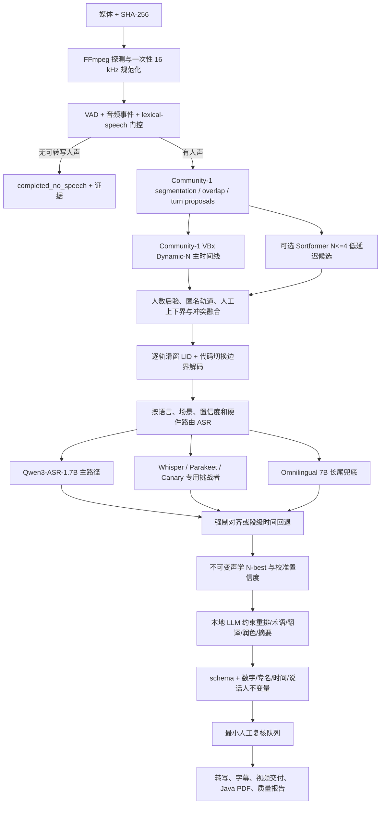

# 旗舰多语种语音系统架构决策

> 决策日期：2026-07-25
> 适用范围：离线人声判断、任意人数说话人分离、多语种/代码切换转录、时间对齐、翻译、润色、字幕和报告
> 决策原则：先选择能力上限高且可部署的基模，再用路由、量化、缓存和分层硬件解决效率；不以当前 16 GB M4 的单机容量降低系统质量上限，也不把“完全离线”与“托管前沿能力”混为同一个部署约束。

## 能力上限定义

“世界最高端”不是挑一个模型名称，而是保留三个不能互相冒充的部署档：

1. **托管前沿质量档**：在用户逐次明确授权媒体上传、数据保留策略和成本后，允许 `pyannote Precision-2` 以及后续登记的托管 ASR 基模参加同音频挑战。Precision-2 是当前官方同口径榜单中的 diarization 能力上限候选；它只在远端运行，因此不能替代离线产品承诺。
2. **私有自托管旗舰档**：在受控 GPU 服务器运行 Qwen3-ASR-1.7B、Omnilingual ASR LLM-7B/7B-ZS、Community-1/VBx、NeMo 挑战者和服务器 LLM。这是默认的高质量生产上限，原始媒体不离开用户控制的基础设施。
3. **M4 边缘质量档**：使用相同契约、缓存和证据链串行运行可容纳模型；资源不足时升级到私有服务器或明确降级，不能把 16 GB 能运行的小模型结果宣称为全系统上限。

托管模型、开源模型和本地量化模型均须使用相同冻结音频、相同计分与失败域比较。外部模型只因公开榜单领先而进入候选池，不会自动获得生产路由权；私有媒体不得为了比较而静默上传。

## 结论

系统采用“旗舰级联 + 专用挑战者 + 长尾兜底”，不采用一个模型包办全部任务：

1. `Qwen3-ASR-1.7B` 是其 30 种语言和 22 种中文方言支持集内的首选 ASR 基模。官方模型卡把它描述为开源 ASR 中的 SOTA，并提供语言识别、流式/离线推理、长音频和独立强制对齐器。
2. `pyannote/speaker-diarization-community-1` 的 powerset segmentation、WeSpeaker embedding 和 VBx clustering 是离线 Dynamic-N 说话人主权威。其全局人数没有 Sortformer 的固定四输出限制，并原生接受 `num_speakers`、`min_speakers` 和 `max_speakers`。托管前沿档以 `pyannote Precision-2` 为当前 incumbent：pyannote 官方在无 collar、保留 overlap 的同表 12 个基准中报告其 `12/12` DER 低于 Community-1；但它不是离线 checkpoint。
3. `facebook/omniASR-LLM-7B` 是服务端支持集外语言的旗舰兜底，覆盖 1600+ 语言；`CTC-300M/1B` 只能作为低成本召回或本机兼容候选，不能用小模型结果代表 7B 上限。
4. `Whisper large-v3` 是成熟的独立第二意见。在 Apple Silicon 上优先验证 WhisperKit/Core ML 或 whisper.cpp/Metal，而不是把 CUDA 路径直接搬到 MPS。
5. `Parakeet-TDT-0.6B-v3` 是 25 种欧洲语言的高吞吐专用挑战者；`Canary-Qwen-2.5B` 是英语专用挑战者。二者只有在本项目 held-out 分桶同时改善 WER、时间轴和效率时才能接管相应路由。
6. Sortformer 只用于 `N <= 4` 的低延迟候选或审计证据。当前公开 checkpoint 输出维度固定为 4，且官方在 5 人以上数据上的 DER 明显退化，不能成为“任意人数”权威。
7. 本地 LLM 与声学权威完全分离。当前 M4 的下一候选是 `qwen3.5:9b` Q4_K_M；服务器质量档至少评测 `Qwen3.5-35B-A3B`，资源允许时再评测 `122B-A10B`。LLM 只能在已有声学 N-best 内做约束重排、术语、翻译、保守润色和证据化报告，不能创建说话人、语言或原音频不存在的文本。

这些是模型晋级候选，不是发布声明。官方自报指标只用于缩小候选集，最终权威是本项目按数据源、录音、说话人隔离的 held-out 结果。

## 模型决策矩阵

| 能力域 | 旗舰权威 | 挑战者/兜底 | 不能作为通用权威的原因 |
|---|---|---|---|
| 人声活动与内容门控 | 轻量 VAD + Community-1 segmentation + ASR no-speech 共识 | Silero VAD、独立音频事件分类器 | 单独 VAD 不能区分歌词、音乐中人声、笑声和可转写词汇 |
| 托管前沿 diarization | Precision-2（仅经逐次授权的可上传媒体） | 后续托管模型按相同盲测登记 | 远端推理不满足默认离线和数据不出域约束；官方榜单不能替代本项目 held-out |
| 私有任意总人数 diarization | Community-1/VBx；服务端并行评测 NeMo cascaded diarizer | CAM++/ERes2NetV2、SpeakerKit Core ML | 单段 embedding 聚类不能独立解决边界、重叠和人数；现有 Dynamic-N 实测会过分裂 |
| 低延迟 1-4 人 diarization | Community-1 仍保留最终审计 | Streaming Sortformer 4spk | 固定 4 个输出通道，5 人以上不是适用域 |
| 30 语言/22 中文方言 ASR | Qwen3-ASR-1.7B | Whisper large-v3、Parakeet 欧洲语种、Canary-Qwen 英语 | 路由挑战者的覆盖或硬件路径更窄 |
| 1600+ 长尾语言 ASR | Omnilingual ASR LLM-7B/7B-ZS 服务端 | Omnilingual CTC 300M/1B 本机召回 | 7B 约 30 GiB、参考实现基于 fairseq2，不适合当前 M4 常驻；覆盖不等于每种语言都达到发布质量 |
| 音频语言识别 | Qwen/Whisper/SpeechBrain VoxLingua107 校准共识 | 未来基于许可兼容数据训练更广 LID head | MMS-LID-4017 是 CC BY-NC 4.0，不能进入默认商业模型包 |
| 时间对齐 | Qwen3-ForcedAligner-0.6B 的 11 语言支持集 | 每语言 CTC aligner、WhisperX/MFA 候选 | 不支持的语言不得伪造词级时间戳，只能保留段级时间和复核状态 |
| 重叠说话 | Community-1 多轨活动 + 局部重叠路由 | 经 SI-SDRi 与 tcpWER 验证的局部分离/多说话人 ASR | 当前没有一个成熟开源模型能对任意语言、任意并发人数无条件分离；全场分离会引入伪影 |
| 文本推理与交付 | M4: Qwen3.5-9B 候选；服务器: 35B-A3B/122B-A10B 候选 | 4B 仅保留已验证的 suggestion-only 业务路径 | 4B 正式基准未达到自动修改门槛；更大参数也不能越过声学证据边界 |

## 目标数据流

## 关键实现规则

### 1. 人数与身份

- `auto` 输出人数后验分布、最优人数、候选区间和校准置信度，不只输出一个整数。
- `manual` 把用户人数作为硬约束，`hybrid` 把上下界和 prior 作为显式约束；任何模式都不能静默丢人或合并人。
- Community-1 常规时间线保存重叠；exclusive 时间线只用于把 ASR 文本归属到唯一轨道，不能抹掉真实 overlap。
- 现有 CAM++/ERes2NetV2/Dynamic-N 降级为独立挑战者、跨段身份稳定证据和不变量检查器。只有 held-out 证明更好后才允许覆盖 Community-1。
- 跨文件实名识别必须是另一个带用户授权的 voiceprint enrollment 功能。普通 diarization 只产生匿名 `speaker-N`，不能从声音猜姓名。

### 2. 多语言与代码切换

- 语言状态属于时间区间，不属于整个文件，也不默认属于某个说话人的固定属性。
- 在 diarization 轨道内以重叠滑窗获取 Qwen、Whisper 和独立 LID 后验，再用带最小驻留时间和切换惩罚的序列解码器定位切换点。
- 对低置信短片段同时保留多个语言候选；脚本特征只验证 ASR 输出，不能从文字反向伪造声学语言真值。
- Qwen 支持集外先进入 Omnilingual 服务端路径；若路由语言也无法可靠确定，则输出 `und` 与复核，不用相近语言硬猜。
- 同一说话人可连续切换语言；不同说话人也可使用相同或不同语言。聚类不得把语言差异当身份差异。

### 3. ASR 路由与融合

- 支持集内默认完整运行 Qwen3-ASR-1.7B，而不是先用 0.6B 决定最终文本；0.6B 只适合作为明确标记的低延迟预览。
- 专用模型按校准后的分桶规则接管：例如欧洲语种可比较 Parakeet，英语可比较 Canary-Qwen，Apple 本机可比较 WhisperKit。
- 模型间不直接比较未经校准的自报 confidence。每个模型、语言、场景使用开发集拟合可靠性，held-out 只做一次晋级判断。
- 保存每个候选的模型 revision、原始文本、token/segment score、语言、时间范围和失败码。融合只能选择或组合可追溯候选。
- 数字、日期、专名和领域词单独计分。LLM 纠正必须引用候选或术语表，并保留 diff。

### 4. 重叠语音

- 先检测再局部升级，只对 overlap 区间加上下文 padding 运行分离或多说话人 ASR。
- 晋级门禁同时要求 SI-SDRi 不下降、下游 tcpWER/cpWER 改善、说话人归属改善且非重叠区不被污染。
- 在该门禁通过前，系统可以准确保存“谁在何时重叠”，但不能宣称所有并发语音都已完整转录。

### 5. 本地 LLM

- 将音频模型全部卸载后再启动/保留 Ollama 推理，当前 16 GB M4 不并驻 Qwen3-ASR、Pyannote 和 9B LLM。
- 输入是带证据 ID 的 N-best、术语表和不可修改字段；输出必须是版本化 JSON patch 或派生产物。
- 说话人、时间、源文和 review blocker 默认只读。翻译、润色和摘要是独立文件，不覆盖 `rawText`。
- 自动应用需按任务和语言分别通过 held-out。`qwen3.5:9b` 参数更多不自动获得权限。

## 计算与模型生命周期

### 托管前沿质量档

- Precision-2 只接收公开样本、合成样本或用户对该次作业明确批准上传的媒体；授权、区域、供应商保留策略、请求 ID、模型版本、成本和删除状态进入审计链。
- 用同一冻结音频比较 Precision-2 与 Community-1/NeMo 的 DER/JER、人数、overlap 和 tcpWER。只有目标分桶 held-out 胜出才允许成为该分桶的 opt-in 路由，不能用供应商平均指标代替。
- 托管 ASR 也采用登记制 challenger pool：必须锁定模型版本、语言/场景适用域、数据策略和预算，再与自托管 Qwen/Whisper/Omnilingual 同音频比较。不存在未经本项目验证的“全球所有语言统一最佳 API”。

### 当前 M4 16 GB 质量档

- Community-1 Python/MPS 或 SpeakerKit/Core ML 二选一驻留，先以相同 RTTM 评分决定；当前已有 Community-1 本地完整模型和真实结果。
- Qwen3-ASR-1.7B 按 ASR 阶段加载一次，处理整批 speech windows 后统一释放；ForcedAligner 在需要的 11 种语言阶段单独加载。
- WhisperKit/whisper.cpp 作为第二意见时与 Qwen 串行，不同时占用统一内存。
- `qwen3.5:9b` 已安装为 Ollama model ID `6488c96fa5fa`，实际为 9.7B、Q4_K_M、6.6 GB；底层 blob SHA-256 为 `dec52a44569a2a25341c4e4d3fee25846eed4f6f0b936278e3a3c900bb99d37c`。只有声学阶段结束后才加载，完整质量晋级前保留 4B 回退；安装后数据卷约剩 15 GiB，仍需保留至少 8 GiB 工作空间。
- M4 的两条真实短样本对照证明跨 job 全常驻可将墙钟从 `197.53 秒` 降到 `135.40 秒`，但最低只剩约 14 MiB free pages，且现有 MPS 资源指标未捕获该压力。M4 私有配置因此使用 `modelResidency=stage`，在启动 9B 业务阶段前释放声学模型；`worker` 常驻留给已做容量门禁的服务器。
- 不在本机运行 Omnilingual LLM-7B FP32；本机只允许先测 CTC 300M/1B 或量化实现，且结果不能代表旗舰 7B。

### 旗舰服务器质量档

- NVIDIA GPU worker 使用 Qwen 官方 vLLM/FlashAttention 路径；Omnilingual 7B 和 NeMo 候选在独立进程/GPU 池中运行。
- 每类模型一个有界 stage queue 和常驻 worker，跨 job 复用权重；相同音频窗口按 `audio hash + model revision + parameters + normalization version` 缓存。
- 多 GPU 通过流水线并行不同作业，不对同一片段默认全模型齐跑。第二意见只由不确定性或已登记分桶触发。

### 当前生命周期状态

2026-07-25 的 60 样本共享 worker 基线只有 5 条 `observed`。第 6 条在 300 秒超时，日志显示 Qwen checkpoint、CAM++ 和 ERes2NetV2 在跨 job 生命周期中反复加载；其余 54 条被 `BATCH_ABORTED`。当前已加入 `stage|worker` 驻留策略、异常清理、worker shutdown 统一释放，以及仅继续未启动作业的有限恢复会话。两条不同真实音频已证明 `worker` 模式的 Qwen/CAM++/ERes 各只初始化一次。持续进度协议也已落地，但完整 60 条重跑仍未完成：

- worker 已在长推理期间发 heartbeat/progress；harness 分离 idle timeout 与不可延长 hard deadline，预算使用 `冷启动 p95 + 音频时长 * 分桶 RTF p95 + 安全余量`。
- 60 条重跑必须让每条得到独立终态；恢复实现通过伪 worker 和两条健康样本回归，不等于 60/60 已完成。
- macOS 必须采集 MPS/统一内存与系统压力峰值，不能继续用 `peakVramMb=0` 或普通 RSS 作容量门禁。
- 并发 preflight 已改用同目录唯一可回收探针文件，并以 32 次、8 线程共享根回归验证；后续仍需在多进程 worker 启动压力测试中保留该门禁。
- 报告必须区分 `model-failed`、`job-timeout`、`batch-aborted` 和 `not-run`。

## 评测与晋级门禁

### 数据隔离

- 按 dataset、原始 recording、speaker identity 和派生源分组切分，禁止同录音章节或同说话人跨 development/held-out 泄漏。
- development 用于阈值、路由和校准；regression 用于日常防回退；held-out 在一个候选版本冻结后只运行一次。
- 全球短样本库用于广度和快速失败定位，不能单独证明远场会议、重叠、代码切换或任意人数质量。
- 增加 AMI/CHiME-6/LibriCSS/NOTSOFAR-1、AISHELL-4/AliMeeting、DIHARD/VoxConverse、SEAME/真实代码切换、MUSAN/AudioSet 类负样本以及带字幕真值的公开视频分桶。

### 不可互相抵消的指标

| 域 | 主要指标 |
|---|---|
| 人声与内容 | speech frame F1、每小时误报、漏报、lexical/non-lexical macro F1、abstention rate |
| 人数 | exact-count accuracy、count MAE、欠分/过分率、人数后验校准误差 |
| diarization | DER/JER（含 overlap、0 collar 与标准 collar）、speaker confusion、overlap P/R/F1 |
| 联合说话人转录 | cpWER、tcpWER、SA-WER、漏说话人率；不能只分别报 DER 和 WER |
| ASR | 每语言 WER/CER、数字/专名错误率、幻觉率、空转录率 |
| 语言与切换 | macro F1、支持集内/外分开统计、切换点 MAE、`und` 与复核率 |
| 对齐 | word/character AAS、边界 p50/p95、越过媒体时长或相互覆盖率 |
| 重叠分离 | SI-SDRi、重叠 tcpWER、非重叠污染率 |
| LLM 派生 | schema、数字/专名/说话人/时间不变量、COMET/MQM 或人工偏好、semantic drift |
| 系统 | 冷/热 RTF、阶段 p50/p95、峰值 RAM/VRAM、加载次数、缓存命中、升级率、失败隔离 |
| 交付 | cue 覆盖/CPS/CPL/安全区、多语字体、mux/burn-in 像素证据、PDF 内容与视觉硬门槛 |

模型只有在 held-out 的目标能力显著提升、所有硬失败域不回退且资源预算可解释时晋级。平均 WER、单条 DER 或官方 leaderboard 排名都不足以晋级。

## 落地顺序

1. 修复当前生产 adapter 生命周期和 batch failure isolation，先让 60/60 都得到独立终态。
2. 将 Community-1 整段 regular/exclusive 时间线提升为默认离线主 diarization 输出，现有 Dynamic-N 只做冲突融合和不变量审计；重跑 N=1/2/3/5 和 held-out。对公开可上传盲测另跑 Precision-2 同音频挑战，保持离线与托管结论分开。
3. 固化 Qwen3-ASR-1.7B 支持集内基线，增加 Whisper large-v3 第二意见；按相同音频、相同切分比较 WER/CER、LID、时间和 RTF。
4. 在服务器烟测 Omnilingual 7B/7B-ZS，并用支持集外语言 held-out 验证，不用 300M 结果替代 7B。
5. 评测 Parakeet 欧洲语种、Canary-Qwen 英语、Sortformer 1-4 人；只有分桶胜出才启用路由。
6. 建立真实代码切换和重叠多说话人门禁，再决定 LID 序列模型、分离模型或多说话人 ASR 的微调方向。
7. 在 M4 上完整评测 `qwen3.5:9b`，服务器评测 35B-A3B；先通过 suggestion-only，再分别评估翻译、润色、摘要和 N-best 重排。
8. 同一批 held-out 输出真实 SRT/WebVTT/ASS、soft-mux、burn-in、Java PDF 和证据报告，任何上游 blocker 都必须传递到发布状态。

## 官方来源

- [Qwen3-ASR-1.7B model card](https://huggingface.co/Qwen/Qwen3-ASR-1.7B), revision `7278e1e70fe206f11671096ffdd38061171dd6e5`, Apache-2.0。
- [Qwen3-ASR repository](https://github.com/QwenLM/Qwen3-ASR), 包含 vLLM、流式和 ForcedAligner 使用边界。
- [Omnilingual ASR LLM-7B](https://huggingface.co/facebook/omniASR-LLM-7B), revision `4b0bada258b398cb7e6c5b3a6ed5448fb914385b`, Apache-2.0。
- [Parakeet-TDT-0.6B-v3](https://huggingface.co/nvidia/parakeet-tdt-0.6b-v3), revision `7c35754d166cca382ad1e53e68b01e7c575f3a1d`, CC BY 4.0。
- [Canary-Qwen-2.5B](https://huggingface.co/nvidia/canary-qwen-2.5b), revision `b1469e1bba1cfe140205529c79c434ca47180960`, CC BY 4.0；官方能力域为英语。
- [Whisper large-v3](https://huggingface.co/openai/whisper-large-v3) 与 [whisper.cpp](https://github.com/ggml-org/whisper.cpp)；后者明确支持 Apple Metal、Core ML、量化和 VAD。
- [Argmax open-source Swift speech stack](https://github.com/argmaxinc/argmax-oss-swift), MIT；WhisperKit 与 SpeakerKit 提供 Apple Core ML 路径，模型许可证仍需逐项随包审计。
- [Community-1 model card](https://huggingface.co/pyannote/speaker-diarization-community-1), revision `3533c8cf8e369892e6b79ff1bf80f7b0286a54ee`, CC BY 4.0；本机隔离镜像已固定并验证。
- [pyannote Community-1 / Precision-2 official benchmark](https://huggingface.co/pyannote/speaker-diarization-community-1#benchmark)，采用无 collar、保留 overlap 的统一 DER 表；Precision-2 为托管远端模型，不得写成离线依赖。
- [NeMo diarization overview](https://docs.nvidia.com/nemo-framework/user-guide/latest/nemotoolkit/asr/speaker_diarization/intro.html), 明确说明 cascaded 系统对人数和会话长度限制更少。
- [Streaming Sortformer 4spk v2.1](https://huggingface.co/nvidia/diar_streaming_sortformer_4spk-v2.1), revision `fafaab5faa1617a0ca52d38dd3dc4bd636800d3d`；官方输出 `S=4`，5 人以上 DER 明显退化。
- [SpeechBrain VoxLingua107 LID](https://huggingface.co/speechbrain/lang-id-voxlingua107-ecapa), revision `0253049ae131d6a4be1c4f0d8b0ff483a0f8c8e9`, Apache-2.0。
- [MMS-LID-4017](https://huggingface.co/facebook/mms-lid-4017), CC BY-NC 4.0；仅作研究比较，不进入默认商业包。
- [Ollama Qwen3.5 tags](https://ollama.com/library/qwen3.5), `9b` Q4 当前标称约 6.6 GB，`27b` 约 17 GB，`35b` 约 24 GB。

所有网页和模型元数据于 2026-07-25 核验。revision、许可证、文件清单和本地哈希必须在实际下载时再次锁定。
