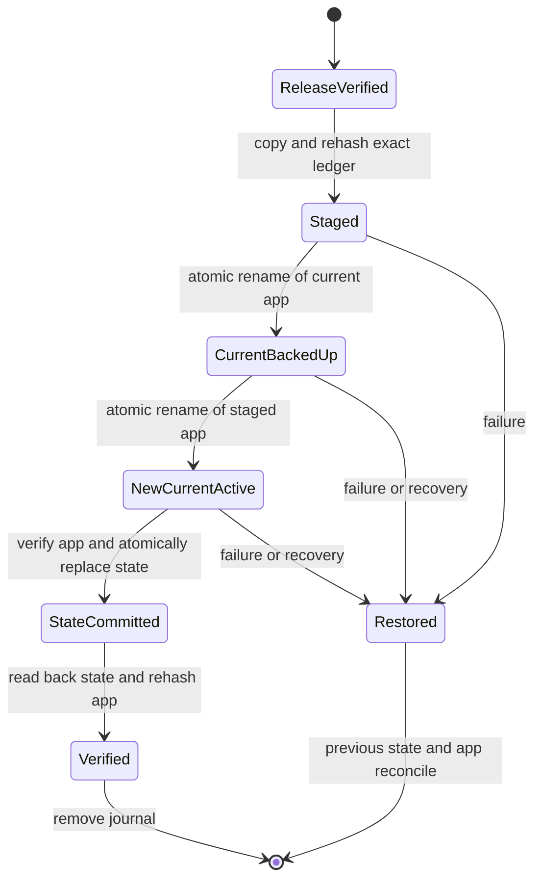

# Native Windows Packaging, Upgrade, Rollback, and Recovery

This document defines the bounded Windows packaging contract for the Tauri desktop application. It does **not** delete, replace, or silently route through the legacy Python packaging stack.

The implementation lives under `packaging/tauri/` and provides:

- a locked Tauri build plan;
- a deterministic release-manifest generator;
- SHA-256 payload and native-installer ledgers;
- production Authenticode policy;
- transactional install and upgrade;
- explicit downgrade and rollback policy;
- interrupted-transaction recovery;
- uninstall with mandatory user-data preservation;
- machine-readable JSON results and non-zero failure exits;
- offline development fixtures and fast pytest coverage.

The Tauri Windows build requires `apps/desktop/src-tauri/icons/icon.png`.
This checked-in 256x256 RGBA asset is derived from the existing desktop scene
artwork; the packaging tests reject a missing or undersized icon before a
release build.

## 1. Boundary and threat model

The lifecycle scripts manage only these paths below `InstallRoot`:

```text
InstallRoot/
├── app/                         # current immutable application payload
├── backups/                     # verified rollback payloads
└── .mts-control/
    ├── install-state.json       # checksummed, atomically replaced envelope
    ├── transaction.json         # checksummed crash-recovery journal
    └── transactions/<id>/       # same-volume staging area
```

User-owned data must be stored in a separate `DataRoot`:

```text
DataRoot/
├── projects/
├── transcripts/
├── exports/
├── speaker-locks/
├── models/
└── preferences/
```

`InstallRoot` and `DataRoot` are required to be non-overlapping. `Uninstall` has no user-data purge option and never recursively removes `InstallRoot` itself. It removes only the three managed application paths shown above, preserving both `DataRoot` and unknown operator-owned files beside the managed paths.

The implementation rejects:

- filesystem roots and protected anchor paths as managed roots;
- an overlapping install and data path;
- a path too long for the PowerShell 5.1 transaction layout;
- absolute payload paths, `..`, alternate data streams, device names, trailing dots/spaces, and backslashes in manifest paths;
- reparse points anywhere in a release or installed payload;
- duplicate paths under case-insensitive Windows comparison;
- undeclared files in the release root, payload, installer ledger, or installed application;
- missing, malformed, or mismatched hashes;
- invalid Authenticode signatures or a signer that does not match the fixed production trust anchor;
- an existing unmanaged `app/` directory;
- same-version repacks;
- implicit version downgrades;
- target releases that cannot read the installed user-data schema;
- state, journal, current payload, and rollback payload disagreement.

## 2. Release bundle contract

`New-TauriRelease.ps1` emits an immutable directory:

```text
release/
├── release-manifest.json
├── release-manifest.json.sha256
├── release-manifest.json.p7s       # detached CMS publisher signature in production
├── payload/
│   ├── media-transcribe-studio.exe
│   ├── backend/                    # packaged worker code
│   ├── contracts/                  # runtime JSON contracts
│   ├── reporting/                  # report assembly runtime
│   ├── pdf-renderer/target/pdf-renderer.jar
│   ├── configs/                    # LLM provider presets and schema
│   ├── configs/model-catalog.v1.json
│   ├── configs/model-catalog.v1.schema.json
│   ├── production.config.example.json
│   ├── production.config.remote.example.json
│   ├── tools/model_manager.py
│   └── bootstrap/                  # runtime/model bootstrap entry points
└── installers/                  # optional hashed NSIS/MSI artifacts
```

The schema is `packaging/tauri/release-manifest.schema.json`.

Important fields:

| Field | Contract |
| --- | --- |
| `contract` | Must be `mts-tauri-release/v1`. |
| `version` | Strict SemVer 2.0.0. |
| `releaseId` | Deterministically derived from app ID, version, architecture, and channel. |
| `sourceDateEpoch` | Explicit reproducible-build time input; no current timestamp is injected. |
| `build.targetTriple` | `x86_64-pc-windows-msvc` or `aarch64-pc-windows-msvc`. |
| `compatibility.minInstalledVersion` | Optional upgrade floor. |
| `compatibility.maxInstalledVersion` | Optional upgrade ceiling. |
| `compatibility.dataSchema` | Readable range and write version. |
| `payload.files` | Sorted exact ledger of relative path, byte size, and lowercase SHA-256. |
| `nativeInstallers` | Exact ledger for optional NSIS/MSI artifacts. |
| `trust` | `authenticode` or explicitly unsafe `development-unsigned`. |

The plain manifest checksum detects accidental corruption. In production,
`release-manifest.json.p7s` signs the exact manifest bytes with detached CMS
and SHA-256. Every validation, install, status, upgrade, rollback, and portable
flow requires an externally configured publisher thumbprint; a manifest cannot
declare its own trust anchor. The CMS signature therefore authenticates the
complete Python, JAR, configuration, bootstrap, and native-artifact ledger.
Replacing any payload and regenerating the manifest/checksum no longer passes.

Declared PE, DLL, MSI, and NSIS files are additionally checked with
Authenticode against the same exact certificate. A system-trusted chain is
accepted normally. An enterprise/self-signed certificate may be accepted only
when its exact thumbprint is the configured trust anchor, the Authenticode
content signature is present, and an X.509 chain built while allowing only an
unknown root has no other validation error. `HashMismatch`, wrong EKU, wrong
publisher, missing signature, and chain errors other than the explicit unknown
root fail closed; a normal valid timestamp chain remains acceptable.

### Runtime and model bootstrap

`New-WindowsReleasePayload.ps1` builds the payload from an explicit allowlist.
It includes the worker code, contracts, PDF runtime, provider presets, reviewed
portable model catalog, production configuration template, and model-manager entry
point. The resulting files are part of the ordinary payload hash ledger.

Model weights and Python environments are not silently copied from the build
workstation. The generated `bootstrap/runtime-bootstrap.v1.json` records
`bundledModelArtifacts: false` and the model-root selection policy:

1. `MTS_MODEL_ROOT`;
2. `D:\models` when drive D exists;
3. `%LOCALAPPDATA%\MediaTranscribeStudio\models`.

After installation, bind an existing worker runtime and seed a user-owned
configuration without overwriting one that already exists:

```powershell
.\bootstrap\Initialize-MtsRuntime.ps1 `
  -WorkerPython "D:\MediaTranscribeStudio\runtime\media-asr\python.exe" `
  -ModelRoot "D:\models" `
  -PersistUserEnvironment
```

Inspect or download models without putting tokens in command arguments or
release artifacts:

```powershell
.\bootstrap\Manage-MtsModels.ps1 list
.\bootstrap\Manage-MtsModels.ps1 pull --provider ollama --model qwen3.5:27b-q4_K_M
.\bootstrap\Manage-MtsModels.ps1 pull --provider huggingface --model <repo> --revision <commit> --token-env HF_TOKEN
```

The provider catalog includes Ollama, Hugging Face Router, first-party APIs,
and custom OpenAI-compatible relays. Configuration stores only the API-key
environment-variable name. Raw keys are never packaged.

### Development fixtures

The files below are deliberately not runnable PE binaries:

```text
packaging/tauri/fixtures/payload-v1/
packaging/tauri/fixtures/payload-v2/
```

They can be used only with `-AllowUnsignedDevelopment`. Omitting that explicit switch fails closed. Production automation must never pass it.

## 3. Reproducible build plan

`Build-TauriRelease.ps1` is the active Windows entry point. It first verifies that
these three application versions are identical:

```text
apps/desktop/package.json
apps/desktop/src-tauri/tauri.conf.json
apps/desktop/src-tauri/Cargo.toml
```

It also requires:

```text
apps/desktop/package-lock.json
apps/desktop/src-tauri/Cargo.lock
```

The declared build sequence is:

```powershell
npm ci
npm run tauri -- build --ci --target x86_64-pc-windows-msvc --bundles nsis,msi --config <temporary-windows-tauri-overlay.json> -- --locked
```

Before invoking Tauri, the entry point stages a weight-free runtime payload and
passes a temporary overlay mapping it to `resources/mts-runtime`. Consequently
both the NSIS and MSI installers contain `backend/worker.py`, contracts, report
runtime, provider/model catalogs, and bootstrap scripts. The overlay is created
outside the repository and removed after the build; it never changes the tracked
`tauri.conf.json`.

The same command also emits a deterministic archive beside the release
directory:

```text
<output-directory>.portable.zip
<output-directory>.portable.zip.sha256
```

The archive is a compressed copy of the verified release directory and can be
unpacked to a user-owned location before running
`payload\bootstrap\Initialize-MtsRuntime.ps1`. It contains no Python runtime or
model weights. Pass `-TargetDirectory D:\build-cache\cargo` to keep Rust build
outputs off the system drive, and use `-Force` only for replacing an unpublished
local candidate.

Inspect the plan without compiling or writing an output:

```powershell
.\packaging\tauri\Build-TauriRelease.ps1 `
  -Architecture x64 `
  -Channel stable `
  -SourceDateEpoch 1784678400 `
  -PublisherThumbprint "EXPECTED_SIGNING_CERTIFICATE_THUMBPRINT" `
    -DryRun
```

On a Windows runner, the repository workflow
`.github/workflows/tauri-windows-release.yml` builds x64 or arm64 candidates,
expands both installer formats, and fails if the embedded runtime marker is not
present. It is manual and uploads artifacts only; it does not publish a GitHub
Release automatically. Signed candidates require these repository secrets:
`WINDOWS_CODESIGN_PFX_BASE64`, `WINDOWS_CODESIGN_PFX_PASSWORD`, and
`WINDOWS_CODESIGN_THUMBPRINT`. An unsigned candidate must be selected explicitly
as `unsigned-development` and is rejected by validation unless
`-AllowUnsignedDevelopment` is supplied.

Create a production release after the Tauri executable and native installers are signed:

```powershell
.\packaging\tauri\Build-TauriRelease.ps1 `
  -OutputDirectory "D:\releases\MediaTranscribeStudio\0.1.0-x64" `
  -Architecture x64 `
  -Channel stable `
  -SourceDateEpoch 1784678400 `
  -MinInstalledVersion "0.1.0" `
  -DataSchemaReadableMin 1 `
  -DataSchemaReadableMax 1 `
  -DataSchemaWriteVersion 1 `
  -PublisherThumbprint "EXPECTED_SIGNING_CERTIFICATE_THUMBPRINT"
```

For deterministic CI, set `SourceDateEpoch` from the authoritative source commit, use clean locked dependency caches, use a pinned Windows SDK/Rust/Node toolchain image, and compare both manifests and artifact hashes across two clean builders. The script makes manifest generation deterministic; it does not by itself guarantee that all upstream PE/MSI toolchains produce byte-identical binaries.

## 4. Validation and dry-run

Validate a production release:

```powershell
.\packaging\tauri\Invoke-TauriLifecycle.ps1 `
  -Action Validate `
  -ReleaseDirectory "D:\releases\MediaTranscribeStudio\0.1.0-x64" `
  -ExpectedAppId "studio.mediatranscribe.desktop" `
  -ExpectedPublisherThumbprint "EXPECTED_SIGNING_CERTIFICATE_THUMBPRINT"
```

Plan an installation without creating `InstallRoot`, `DataRoot`, state, a journal, or a staging directory:

```powershell
.\packaging\tauri\Invoke-TauriLifecycle.ps1 `
  -Action Install `
  -ReleaseDirectory "D:\releases\MediaTranscribeStudio\0.1.0-x64" `
  -InstallRoot "C:\Program Files\MediaTranscribe Studio" `
  -DataRoot "$env:LOCALAPPDATA\MediaTranscribeStudio" `
  -ExpectedPublisherThumbprint "EXPECTED_SIGNING_CERTIFICATE_THUMBPRINT" `
  -DryRun
```

Dry-run still validates the release, trust policy, paths, existing install state, compatibility, and current payload. It skips all writes and renames.

All command wrappers print a JSON object. A successful mutating action reports:

```json
{
  "ok": true,
  "status": "committed-and-verified"
}
```

This status is emitted only after:

1. the source release ledger passes;
2. the staged ledger passes;
3. the atomic directory switch completes;
4. the activated ledger and entry point pass;
5. install state is atomically committed;
6. state is read back and revalidated;
7. state and activated manifest hashes reconcile;
8. the activated payload is rehashed again;
9. the transaction journal is removed.

Any failure returns a non-zero process exit. The scripts do not convert a failed or unverified install into a success message.

## 5. Transaction model



Staging occurs under `InstallRoot`, ensuring that the current/backup/stage renames stay on one volume. The state and journal are single-file checksum envelopes. Their embedded JSON is hashed byte-for-byte and parsed only after checksum verification.

### Install

`Install` requires no committed managed state and no pre-existing unmanaged `app/` directory:

```powershell
.\packaging\tauri\Invoke-TauriLifecycle.ps1 `
  -Action Install `
  -ReleaseDirectory "D:\releases\MediaTranscribeStudio\0.1.0-x64" `
  -InstallRoot "C:\Program Files\MediaTranscribe Studio" `
  -DataRoot "$env:LOCALAPPDATA\MediaTranscribeStudio" `
  -ExpectedPublisherThumbprint "EXPECTED_SIGNING_CERTIFICATE_THUMBPRINT"
```

### Upgrade

`Upgrade` requires a committed state and an exactly verified current payload:

```powershell
.\packaging\tauri\Invoke-TauriLifecycle.ps1 `
  -Action Upgrade `
  -ReleaseDirectory "D:\releases\MediaTranscribeStudio\0.2.0-x64" `
  -InstallRoot "C:\Program Files\MediaTranscribe Studio" `
  -DataRoot "$env:LOCALAPPDATA\MediaTranscribeStudio" `
  -ExpectedPublisherThumbprint "EXPECTED_SIGNING_CERTIFICATE_THUMBPRINT"
```

Before staging, the script enforces:

- target SemVer differs from current SemVer;
- an older target requires explicit `-AllowDowngrade`;
- current version is inside the target release’s upgrade range;
- current user-data schema is readable by the target.

The prior current application becomes a versioned, hash-addressed rollback directory only after it has been verified against committed state.

### Rollback

Rollback is explicit and treated as a downgrade:

```powershell
.\packaging\tauri\Invoke-TauriLifecycle.ps1 `
  -Action Rollback `
  -InstallRoot "C:\Program Files\MediaTranscribe Studio" `
  -DataRoot "$env:LOCALAPPDATA\MediaTranscribeStudio" `
  -ExpectedPublisherThumbprint "EXPECTED_SIGNING_CERTIFICATE_THUMBPRINT" `
  -AllowDowngrade
```

The recorded backup must:

- remain under the managed `backups/` directory;
- have a valid manifest and exact payload ledger;
- reconcile with the hash recorded in committed state;
- be able to read the current user-data schema.

The current release becomes the next rollback candidate, so a successful rollback can be reversed through another explicit rollback.

## 6. Recovery

Run recovery before any further mutation if `transaction.json` exists:

```powershell
.\packaging\tauri\Invoke-TauriLifecycle.ps1 `
  -Action Recover `
  -InstallRoot "C:\Program Files\MediaTranscribe Studio" `
  -DataRoot "$env:LOCALAPPDATA\MediaTranscribeStudio" `
  -ExpectedPublisherThumbprint "EXPECTED_SIGNING_CERTIFICATE_THUMBPRINT"
```

Recovery policy:

| Journal phase | Recovery behavior |
| --- | --- |
| `initializing` | Discard the uncommitted transaction directory. |
| `staged` | Discard the verified but inactive stage. |
| `current-backed-up` | Verify and restore the prior application and prior state. |
| `new-current-active` | Treat the new current as uncommitted; verify and restore the prior application and state. |
| `state-committed` | Verify current state and payload, then finalize journal cleanup. |

If the required backup, journal checksum, prior state, or payload hash is invalid, recovery fails closed and leaves evidence for operator inspection.

## 7. Status and uninstall

Verify current state:

```powershell
.\packaging\tauri\Invoke-TauriLifecycle.ps1 `
  -Action Status `
  -InstallRoot "C:\Program Files\MediaTranscribe Studio" `
  -DataRoot "$env:LOCALAPPDATA\MediaTranscribeStudio" `
  -ExpectedPublisherThumbprint "EXPECTED_SIGNING_CERTIFICATE_THUMBPRINT"
```

Remove the managed application while retaining all user data:

```powershell
.\packaging\tauri\Invoke-TauriLifecycle.ps1 `
  -Action Uninstall `
  -InstallRoot "C:\Program Files\MediaTranscribe Studio" `
  -DataRoot "$env:LOCALAPPDATA\MediaTranscribeStudio" `
  -ExpectedPublisherThumbprint "EXPECTED_SIGNING_CERTIFICATE_THUMBPRINT"
```

Uninstall first verifies state and the full current payload. It then removes only `app/`, `backups/`, and `.mts-control/`. It verifies that application state is gone and `DataRoot` still exists before reporting success.

## 8. Automated verification

Run the focused suite with the repository-local temporary root:

```powershell
$env:PYTHONIOENCODING = "utf-8"
python -m pytest -q `
  tests/test_tauri_packaging.py `
  --basetemp ".codex/pytest-tauri-packaging"
```

The tests cover:

- JSON Schema validity;
- locked build-plan version coherence;
- dry-run non-mutation;
- deterministic manifest bytes;
- explicit unsigned-development consent;
- fixed production publisher trust-anchor enforcement;
- detached CMS signature creation, preservation, and verification;
- rejection of a missing CMS signature and payload replacement followed by a recomputed manifest/checksum;
- install/data path separation;
- traversal and undeclared-file rejection;
- payload hash mismatch fail-closed behavior;
- atomic upgrade and verified backup creation;
- default downgrade rejection and explicit override;
- rollback with user-data retention;
- interrupted-switch recovery;
- state-envelope tamper detection;
- managed-only uninstall;
- SemVer ordering.

## 9. Required real-installer acceptance before production release

The automated fixture suite proves the lifecycle contract but does not replace real Windows installer acceptance. A production release remains blocked until all items below are executed on clean Windows x64 and, if shipped, Windows ARM64 machines:

1. Build actual Tauri NSIS and MSI bundles from a clean locked runner.
2. Sign the application executable, DLLs, NSIS executable, and MSI with the production certificate.
3. Verify the exact publisher thumbprint and timestamp chain on an offline validation machine.
4. Install under `C:\Program Files` with real UAC elevation and a standard non-admin user profile.
5. Launch the installed Tauri executable and complete an IPC/backend health probe.
6. Upgrade while the application is closed.
7. Attempt upgrade while the application is running and confirm lock handling fails without partial mutation.
8. Exercise Start Menu shortcuts, uninstaller registration, application identity, icons, and Windows Apps & Features metadata.
9. Simulate power loss or process termination at every journal phase and verify recovery.
10. Verify upgrade, rollback, and uninstall with large real user-data directories and locked export files.
11. Verify MSI repair, NSIS uninstall, and interactions with enterprise software deployment tools.
12. Verify Windows Defender, SmartScreen reputation, certificate expiry/timestamp behavior, and antivirus quarantine recovery.
13. Compare artifacts from two clean pinned builders; document any unavoidable PE/MSI nondeterminism.
14. Confirm that rollback remains data-schema safe after every real application migration.

Until these checks pass, the correct claim is: **the manifest and transactional lifecycle are fixture-tested; the real signed installer is not yet production-accepted**.
